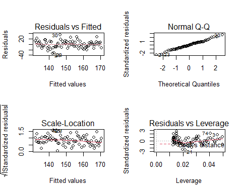
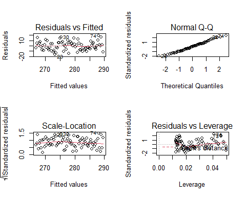

Analysis of Length of Growing Season
================
Curtis C. Bohlen, Casco Bay Estuary Partnership
11/09/2021

-   [Load Libraries](#load-libraries)
-   [Read Data](#read-data)
-   [Find First and Last Frost Dates](#find-first-and-last-frost-dates)
-   [Statistical Analysis](#statistical-analysis)
    -   [Frost Free Period](#frost-free-period)
    -   [Date of First Frosts](#date-of-first-frosts)
    -   [Date of Last Spring Frost](#date-of-last-spring-frost)
-   [Robust alternatives to Gaussian
    Models](#robust-alternatives-to-gaussian-models)


# Load Libraries

``` r
library(tidyverse)
#> Warning: package 'tidyverse' was built under R version 4.0.5
#> -- Attaching packages --------------------------------------- tidyverse 1.3.1 --
#> v ggplot2 3.3.5     v purrr   0.3.4
#> v tibble  3.1.4     v dplyr   1.0.7
#> v tidyr   1.1.3     v stringr 1.4.0
#> v readr   2.0.1     v forcats 0.5.1
#> Warning: package 'ggplot2' was built under R version 4.0.5
#> Warning: package 'tibble' was built under R version 4.0.5
#> Warning: package 'tidyr' was built under R version 4.0.5
#> Warning: package 'readr' was built under R version 4.0.5
#> Warning: package 'dplyr' was built under R version 4.0.5
#> Warning: package 'forcats' was built under R version 4.0.5
#> -- Conflicts ------------------------------------------ tidyverse_conflicts() --
#> x dplyr::filter() masks stats::filter()
#> x dplyr::lag()    masks stats::lag()
library(readr)
library(mblm)

library(CBEPgraphics)
load_cbep_fonts()
theme_set(theme_cbep())
```

# Read Data

The frost-free period needs to be derived directly from the daily
temperature data. Note that temperature in the source data is in tenths
of a degree C.

``` r
sibfldnm <- 'Data'
parent <- dirname(getwd())
sibling <- paste(parent,sibfldnm, sep = '/')
fn <- 'longdailydata.csv'

longdailydata <- read_csv(paste(sibling,fn, sep = '/')) %>%
  select(-station) %>%
  filter(datatype %in% c('TMAX', 'TMIN')) %>%
  mutate(doy =  as.numeric(format(date, format='%j'))) %>%
  mutate(month = as.numeric(format(date, format='%m'))) %>%
  mutate(year = as.numeric(format(date, format='%Y'))) %>%
  mutate(cyear = year-1980)
#> Rows: 370361 Columns: 5
#> -- Column specification --------------------------------------------------------
#> Delimiter: ","
#> chr  (3): datatype, attributes, station
#> dbl  (1): value
#> dttm (1): date
#> 
#> i Use `spec()` to retrieve the full column specification for this data.
#> i Specify the column types or set `show_col_types = FALSE` to quiet this message.
```

# Find First and Last Frost Dates

The following strategy was suggested by a Stack Overflow answer here:  
<https://stackoverflow.com/questions/41328946/find-last-values-by-condition>

In brief, we filter a dataframe down to data that meets our criteria –
here, days with temperatures below freezing – and then group\_by() to
isolate data from each year, and finally slice() to pick the first or
last item in the list. Be aware that this strategy depends on the data
being in chronological order.

``` r
cutoffinF <- 32
cutoffinC <- (cutoffinF - 32) * 5/9

firstfrosts <- longdailydata %>%
  spread(key = datatype, value = value) %>%
  filter(year>1940) %>%                 # 1940 is an incomplete year in the daily data
  mutate(TMIN = TMIN/10) %>%            # raw data is in tenths of degree C
  filter(TMIN<= cutoffinC) %>%          # Only days below freezing
  filter(month>=7) %>%                  # only the last half of the year
  group_by(year) %>%
  slice(1)  %>%                         # Choose the first record
  select(date, year, doy)

lastfrosts <- longdailydata %>%
  spread(key = datatype, value = value) %>%
  filter(year>1940) %>%                 # 1940 is an incomplete year in the daily data
  mutate(TMIN = TMIN/10) %>%            # raw data is in tenths of degree C
  filter(TMIN<= cutoffinC) %>%          # Only days below freezing
  filter(month<7) %>%                   # only the first half of the year
  group_by(year) %>%
  slice(n())  %>%                       # Choose the last record
  select(date, year, doy)

frosts <- inner_join(firstfrosts,lastfrosts, by = "year", suffix = c('.first', '.last')) %>%
  mutate(frostfree = doy.first - doy.last - 1) # calculate frost-free period

rm(firstfrosts,lastfrosts)
```

# Statistical Analysis

## Frost Free Period

We start with a Gaussian model.

``` r
ffdays.lm <- lm(frostfree~ year, data = frosts)
summary(ffdays.lm)
#> 
#> Call:
#> lm(formula = frostfree ~ year, data = frosts)
#> 
#> Residuals:
#>     Min      1Q  Median      3Q     Max 
#> -33.049  -9.250  -0.504   8.485  34.549 
#> 
#> Coefficients:
#>               Estimate Std. Error t value Pr(>|t|)    
#> (Intercept) -817.11344  130.79856  -6.247 2.13e-08 ***
#> year           0.48912    0.06606   7.405 1.41e-10 ***
#> ---
#> Signif. codes:  0 '***' 0.001 '**' 0.01 '*' 0.05 '.' 0.1 ' ' 1
#> 
#> Residual standard error: 13.39 on 77 degrees of freedom
#> Multiple R-squared:  0.4159, Adjusted R-squared:  0.4083 
#> F-statistic: 54.83 on 1 and 77 DF,  p-value: 1.412e-10
```

So, on average, the number of frost free days over the last 80 years has
declined by about half a day a year, or about 39 days overall.

``` r
 round(coef(ffdays.lm)[2]*80,2)
#>  year 
#> 39.13
```

``` r
oldpar <- par(mfrow=c(2,2))
plot(ffdays.lm)
```



``` r
par(oldpar)
```

Theoretically, we are dealing with count data, so perhaps something
other than a Gaussian model (Binomial, Poisson GLM?) would perform
better, but we don’t see any strong deviations (here) from normality.
That’s not unreasonable since the binomial distribution for high counts
converges on a normal distribution.

## Date of First Frosts

``` r
firstfrosts.lm <- lm(doy.first ~ year, data = frosts)
summary(firstfrosts.lm)
#> 
#> Call:
#> lm(formula = doy.first ~ year, data = frosts)
#> 
#> Residuals:
#>      Min       1Q   Median       3Q      Max 
#> -16.2453  -6.3262  -0.1629   5.1501  18.8830 
#> 
#> Coefficients:
#>               Estimate Std. Error t value Pr(>|t|)    
#> (Intercept) -299.16894   79.97312  -3.741 0.000351 ***
#> year           0.29160    0.04039   7.220 3.18e-10 ***
#> ---
#> Signif. codes:  0 '***' 0.001 '**' 0.01 '*' 0.05 '.' 0.1 ' ' 1
#> 
#> Residual standard error: 8.186 on 77 degrees of freedom
#> Multiple R-squared:  0.4037, Adjusted R-squared:  0.396 
#> F-statistic: 52.13 on 1 and 77 DF,  p-value: 3.176e-10
```

Slightly more than half of the trend in length of growing season is due
to later first frosts, about 23 days.

``` r
 round(coef(firstfrosts.lm )[2]*80,2)
#>  year 
#> 23.33
```

``` r
oldpar <- par(mfrow=c(2,2))
plot(firstfrosts.lm)
```



``` r
par(oldpar)
```

## Date of Last Spring Frost

``` r
lastfrosts.lm <- lm(doy.last ~ year, data = frosts)
summary(lastfrosts.lm)
#> 
#> Call:
#> lm(formula = doy.last ~ year, data = frosts)
#> 
#> Residuals:
#>      Min       1Q   Median       3Q      Max 
#> -22.2434  -5.4104   0.1392   5.4728  21.3864 
#> 
#> Coefficients:
#>              Estimate Std. Error t value Pr(>|t|)    
#> (Intercept) 516.94450   94.63391   5.463 5.56e-07 ***
#> year         -0.19752    0.04779  -4.133 9.03e-05 ***
#> ---
#> Signif. codes:  0 '***' 0.001 '**' 0.01 '*' 0.05 '.' 0.1 ' ' 1
#> 
#> Residual standard error: 9.687 on 77 degrees of freedom
#> Multiple R-squared:  0.1816, Adjusted R-squared:  0.1709 
#> F-statistic: 17.08 on 1 and 77 DF,  p-value: 9.034e-05
```

So last frosts have moved just over two weeks earlier over eighty years:

``` r
round(coef(lastfrosts.lm)[2]*80,2)
#>  year 
#> -15.8
```

# Robust alternatives to Gaussian Models

The corresponding Thiel-Sen estimators are similar. Here we use the
‘mblm’ or “Median Based Linear Models” functions from the mblm package.
This fits a Theil-Sen estimator, which is a more robust version of
fitting a linear trend. I also run a Kendal’s Tau test, which is
(roughly) a test that checks if the Theil-Sen estimator is statistically
significant.

``` r
ffdays.ts <- mblm(frostfree~ year, dataframe = frosts)
summary(ffdays.ts)
#> 
#> Call:
#> mblm(formula = frostfree ~ year, dataframe = frosts)
#> 
#> Residuals:
#>     Min      1Q  Median      3Q     Max 
#> -32.106  -8.029   1.076  10.327  35.667 
#> 
#> Coefficients:
#>              Estimate       MAD V value Pr(>|V|)    
#> (Intercept) -779.9154  487.3406      69 1.56e-13 ***
#> year           0.4697    0.2484    3136 2.92e-14 ***
#> ---
#> Signif. codes:  0 '***' 0.001 '**' 0.01 '*' 0.05 '.' 0.1 ' ' 1
#> 
#> Residual standard error: 13.46 on 77 degrees of freedom
cor.test(~frostfree+year, data = frosts, method = 'kendall')
#> 
#>  Kendall's rank correlation tau
#> 
#> data:  frostfree and year
#> z = 6.1417, p-value = 8.163e-10
#> alternative hypothesis: true tau is not equal to 0
#> sample estimates:
#>       tau 
#> 0.4742577
```

``` r
firstfrosts.ts <- mblm(doy.first ~ year, dataframe = frosts)
summary(firstfrosts.ts)
#> 
#> Call:
#> mblm(formula = doy.first ~ year, dataframe = frosts)
#> 
#> Residuals:
#>      Min       1Q   Median       3Q      Max 
#> -22.8047 -11.7332  -5.9793  -0.8999  14.2430 
#> 
#> Coefficients:
#>              Estimate       MAD V value Pr(>|V|)    
#> (Intercept) -218.7350  249.9638     329 9.88e-10 ***
#> year           0.2540    0.1272    3141 2.42e-14 ***
#> ---
#> Signif. codes:  0 '***' 0.001 '**' 0.01 '*' 0.05 '.' 0.1 ' ' 1
#> 
#> Residual standard error: 10.18 on 77 degrees of freedom
cor.test(~doy.first+year, data = frosts, method = 'kendall')
#> 
#>  Kendall's rank correlation tau
#> 
#> data:  doy.first and year
#> z = 5.6313, p-value = 1.789e-08
#> alternative hypothesis: true tau is not equal to 0
#> sample estimates:
#>       tau 
#> 0.4364837
```

``` r
lastfrosts.ts <- mblm(doy.last ~ year, dataframe = frosts)
summary(lastfrosts.ts)
#> 
#> Call:
#> mblm(formula = doy.last ~ year, dataframe = frosts)
#> 
#> Residuals:
#>      Min       1Q   Median       3Q      Max 
#> -21.7816  -4.7330   0.6569   5.9789  21.7523 
#> 
#> Coefficients:
#>             Estimate      MAD V value Pr(>|V|)    
#> (Intercept) 532.2400 307.0969    3053 6.19e-13 ***
#> year         -0.2055   0.1482     280 2.14e-10 ***
#> ---
#> Signif. codes:  0 '***' 0.001 '**' 0.01 '*' 0.05 '.' 0.1 ' ' 1
#> 
#> Residual standard error: 9.702 on 77 degrees of freedom
cor.test(~doy.last+year, data = frosts, method = 'kendall')
#> 
#>  Kendall's rank correlation tau
#> 
#> data:  doy.last and year
#> z = -3.9164, p-value = 8.988e-05
#> alternative hypothesis: true tau is not equal to 0
#> sample estimates:
#>        tau 
#> -0.3041272
```
