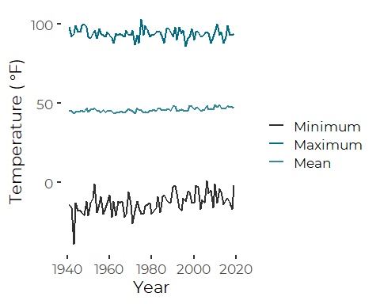
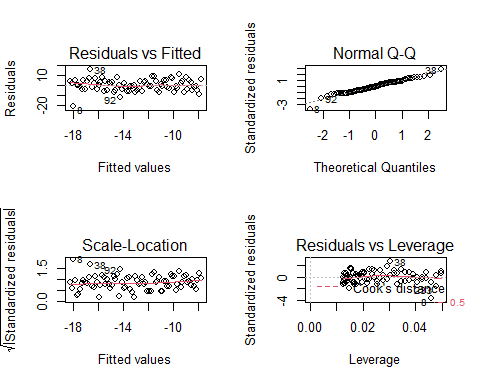
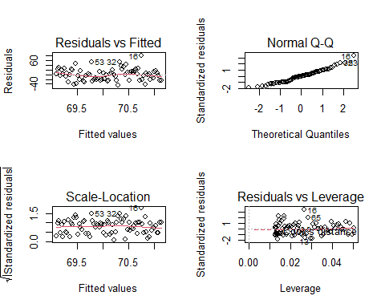
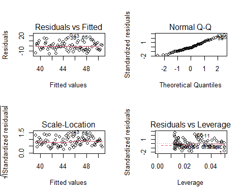

Analysis of Portland Jetport Historical Weather Data
================
Curtis C. Bohlen, Casco Bay Estuary Partnership
11/09/2021

-   [Install Libraries](#install-libraries)
-   [Read Data](#read-data)
-   [Annual Minimum, Maximum and Average
    Temperature](#annual-minimum-maximum-and-average-temperature)
    -   [Initial Plot](#initial-plot)
    -   [Linear Trends](#linear-trends)
        -   [Trend in “mean” Temperature](#trend-in-mean-temperature)
        -   [Trend in Minimum
            Temperature](#trend-in-minimum-temperature)
        -   [Trend in Maximum
            Temperature](#trend-in-maximum-temperature)
-   [Precipitation Totals](#precipitation-totals)
    -   [Linear Models](#linear-models)
        -   [Total Annual Snowfal](#total-annual-snowfal)
        -   [Total Annual Precipitation](#total-annual-precipitation)


# Install Libraries

``` r
library(tidyverse)
#> Warning: package 'tidyverse' was built under R version 4.0.5
#> -- Attaching packages --------------------------------------- tidyverse 1.3.1 --
#> v ggplot2 3.3.5     v purrr   0.3.4
#> v tibble  3.1.4     v dplyr   1.0.7
#> v tidyr   1.1.3     v stringr 1.4.0
#> v readr   2.0.1     v forcats 0.5.1
#> Warning: package 'ggplot2' was built under R version 4.0.5
#> Warning: package 'tibble' was built under R version 4.0.5
#> Warning: package 'tidyr' was built under R version 4.0.5
#> Warning: package 'readr' was built under R version 4.0.5
#> Warning: package 'dplyr' was built under R version 4.0.5
#> Warning: package 'forcats' was built under R version 4.0.5
#> -- Conflicts ------------------------------------------ tidyverse_conflicts() --
#> x dplyr::filter() masks stats::filter()
#> x dplyr::lag()    masks stats::lag()
library(readr)

library(CBEPgraphics)
load_cbep_fonts()
theme_set(theme_cbep())
```

# Read Data

``` r
sibfldnm <- 'Data'
parent <- dirname(getwd())
sibling <- paste(parent,sibfldnm, sep = '/')
fn <- 'longannualdata.csv'

longannualdata <- read_csv(paste(sibling,fn, sep = '/')) %>%
  select(-station) %>%
  mutate(year = as.numeric(format(date, format='%Y'))) %>%
  mutate(cyear = year-1980)
#> Rows: 2981 Columns: 5
#> -- Column specification --------------------------------------------------------
#> Delimiter: ","
#> chr  (3): datatype, attributes, station
#> dbl  (1): value
#> dttm (1): date
#> 
#> i Use `spec()` to retrieve the full column specification for this data.
#> i Specify the column types or set `show_col_types = FALSE` to quiet this message.
```

Making sense of that data requires looking at the metadata, but here’s a
list of the datatypes included.

``` r
levels(factor(longannualdata$datatype))
#>  [1] "AWND" "CDSD" "CLDD" "DP01" "DP10" "DP1X" "DSND" "DSNW" "DT00" "DT32"
#> [11] "DX32" "DX70" "DX90" "EMNT" "EMSD" "EMSN" "EMXP" "EMXT" "FZF0" "FZF1"
#> [21] "FZF2" "FZF3" "FZF4" "FZF5" "FZF6" "FZF7" "FZF8" "FZF9" "HDSD" "HTDD"
#> [31] "PRCP" "PSUN" "SNOW" "TAVG" "TMAX" "TMIN" "TSUN" "WDF1" "WDF2" "WDF5"
#> [41] "WDFG" "WDFM" "WSF1" "WSF2" "WSF5" "WSFG" "WSFM"
```

And their frequencies. Most data records are available for all years, A
handful, mostly wind related, are inly available more recently.

``` r
longannualdata %>%
  group_by(datatype) %>%
  summarize(n=n())
#> # A tibble: 47 x 2
#>    datatype     n
#>    <chr>    <int>
#>  1 AWND        36
#>  2 CDSD        79
#>  3 CLDD        79
#>  4 DP01        79
#>  5 DP10        79
#>  6 DP1X        79
#>  7 DSND        74
#>  8 DSNW        78
#>  9 DT00        79
#> 10 DT32        79
#> # ... with 37 more rows
```

# Annual Minimum, Maximum and Average Temperature

Codes for Key Temperature records in the downloaded annual data are: \*
TAVG – Annual Average Temperature (unweighted; effectively average of
monthly averages, of daily maxes and mins. Note that this means this is
not independent of the other two metrics.) \* EMXT – Extreme Maximum
Annual Temperature \* EMNT – Extreme Minimum Temperature

Note that in 2015 State of the Bay, we calculated our own annual means,
mins and maxes from the daily records.

## Initial Plot

``` r
tdata <- longannualdata %>%
  filter(datatype %in% c('TAVG', 'EMXT', 'EMNT')) %>%
  mutate(value = value*(9/5)+32)

plt <- ggplot(tdata, aes(year, value, color=datatype)) + geom_line(size=1) +
  xlab('Year') +
  theme_cbep() +
  ylab (expression('Temperature ('*~degree*F*')')) +
  scale_color_manual(values = cbep_colors2(), name = '', 
                     labels = c('Minimum', 'Maximum', 'Mean'))
plt
```



## Linear Trends

``` r
tdataF <- longannualdata %>%
  filter(datatype %in% c('TAVG', 'EMXT', 'EMNT')) %>%
  mutate(value = value*(9/5)+32) %>%
  spread(key = datatype, value = value)
mean.lm <- lm(TAVG~ cyear, data = tdataF)
min.lm <- lm(EMNT~ cyear, data = tdataF)
max.lm <- lm(EMXT~ cyear, data = tdataF)
```

### Trend in “mean” Temperature

Remember the mean temperature is based on means of maximums and
minimums, in part.

``` r
summary(mean.lm)
#> 
#> Call:
#> lm(formula = TAVG ~ cyear, data = tdataF)
#> 
#> Residuals:
#>      Min       1Q   Median       3Q      Max 
#> -2.14860 -0.78666 -0.07152  0.60540  2.44506 
#> 
#> Coefficients:
#>              Estimate Std. Error t value Pr(>|t|)    
#> (Intercept) 45.821722   0.120566 380.055  < 2e-16 ***
#> cyear        0.037140   0.005287   7.025 7.47e-10 ***
#> ---
#> Signif. codes:  0 '***' 0.001 '**' 0.01 '*' 0.05 '.' 0.1 ' ' 1
#> 
#> Residual standard error: 1.072 on 77 degrees of freedom
#>   (158 observations deleted due to missingness)
#> Multiple R-squared:  0.3906, Adjusted R-squared:  0.3826 
#> F-statistic: 49.34 on 1 and 77 DF,  p-value: 7.468e-10
```

So, mean annual temperature has increased about 0.037 degrees F per
year, or about one degree C every twenty seven years. (Note thast this
“average” may not be what we woulnd normally consider an average – I
believe it’s the average of daily aversges of maximum and minimum
temperatures.)

### Trend in Minimum Temperature

``` r
summary(min.lm)
#> 
#> Call:
#> lm(formula = EMNT ~ cyear, data = tdataF)
#> 
#> Residuals:
#>     Min      1Q  Median      3Q     Max 
#> -20.976  -3.963  -0.364   4.149  15.666 
#> 
#> Coefficients:
#>              Estimate Std. Error t value Pr(>|t|)    
#> (Intercept) -12.99316    0.65964 -19.697  < 2e-16 ***
#> cyear         0.13380    0.02893   4.625 1.48e-05 ***
#> ---
#> Signif. codes:  0 '***' 0.001 '**' 0.01 '*' 0.05 '.' 0.1 ' ' 1
#> 
#> Residual standard error: 5.863 on 77 degrees of freedom
#>   (158 observations deleted due to missingness)
#> Multiple R-squared:  0.2174, Adjusted R-squared:  0.2073 
#> F-statistic: 21.39 on 1 and 77 DF,  p-value: 1.484e-05
```

Minimum temperatures have increased substantially faster, climbing
0.1338 degrees per year, or climinag about one degree F every seven
years.

``` r
oldpar <- par(mfrow=c(2,2))
plot(min.lm)
```



``` r
par(oldpar)
```

No terrible violations of assumptions there.

### Trend in Maximum Temperature

``` r
summary(max.lm)
#> 
#> Call:
#> lm(formula = EMXT ~ cyear, data = tdataF)
#> 
#> Residuals:
#>     Min      1Q  Median      3Q     Max 
#> -7.5331 -1.6315 -0.2082  1.7644  8.9838 
#> 
#> Coefficients:
#>             Estimate Std. Error t value Pr(>|t|)    
#> (Intercept) 93.84025    0.36211 259.147   <2e-16 ***
#> cyear       -0.01920    0.01588  -1.209     0.23    
#> ---
#> Signif. codes:  0 '***' 0.001 '**' 0.01 '*' 0.05 '.' 0.1 ' ' 1
#> 
#> Residual standard error: 3.219 on 77 degrees of freedom
#>   (158 observations deleted due to missingness)
#> Multiple R-squared:  0.01862,    Adjusted R-squared:  0.00588 
#> F-statistic: 1.461 on 1 and 77 DF,  p-value: 0.2304
```

Maximum temperatures continue to not show a long term trend.

# Precipitation Totals

13.PRCP: Total Monthly (Annual) precipitation. Precipitation totals are
based on daily or multi-day (if daily is missing) precipitation report,
in millimeters to tenths.

18.SNOW Total Monthly (Annual) Snowfall in millimeters.

``` r
pdatalong <- longannualdata %>%
  filter(datatype %in% c('PRCP', 'SNOW')) %>%
  mutate(datatype = factor(datatype)) %>%
  mutate(value = value*0.0394)

pdata <- longannualdata %>%
  filter(datatype %in% c('PRCP', 'SNOW')) %>%
  mutate(datatype = factor(datatype)) %>%
  mutate(value = value*0.0394) %>%
  spread(key=datatype, value=value)
```

## Linear Models

### Total Annual Snowfal

``` r
snow.lm <- lm(SNOW~year, data = pdata)
summary(snow.lm)
#> 
#> Call:
#> lm(formula = SNOW ~ year, data = pdata)
#> 
#> Residuals:
#>     Min      1Q  Median      3Q     Max 
#> -43.979 -21.485   0.044  14.399  79.452 
#> 
#> Coefficients:
#>              Estimate Std. Error t value Pr(>|t|)
#> (Intercept) 121.62812  239.10818   0.509    0.612
#> year         -0.02602    0.12077  -0.215    0.830
#> 
#> Residual standard error: 24.4 on 76 degrees of freedom
#>   (2 observations deleted due to missingness)
#> Multiple R-squared:  0.0006103,  Adjusted R-squared:  -0.01254 
#> F-statistic: 0.04641 on 1 and 76 DF,  p-value: 0.83
```

``` r
oldpar <- par(mfrow=c(2,2))
plot(snow.lm)
```



``` r
par(oldpar)
```

### Total Annual Precipitation

``` r
precip.lm <- lm(PRCP~year, data = pdata)
summary(precip.lm)
#> 
#> Call:
#> lm(formula = PRCP ~ year, data = pdata)
#> 
#> Residuals:
#>     Min      1Q  Median      3Q     Max 
#> -15.163  -5.779  -1.963   4.900  20.995 
#> 
#> Coefficients:
#>               Estimate Std. Error t value Pr(>|t|)    
#> (Intercept) -246.88834   79.97801  -3.087 0.002811 ** 
#> year           0.14740    0.04039   3.649 0.000476 ***
#> ---
#> Signif. codes:  0 '***' 0.001 '**' 0.01 '*' 0.05 '.' 0.1 ' ' 1
#> 
#> Residual standard error: 8.186 on 77 degrees of freedom
#>   (1 observation deleted due to missingness)
#> Multiple R-squared:  0.1475, Adjusted R-squared:  0.1364 
#> F-statistic: 13.32 on 1 and 77 DF,  p-value: 0.0004765
```

``` r
oldpar <- par(mfrow=c(2,2))
plot(precip.lm)
```



``` r
par(oldpar)
```

So, Precipitation is increasing by about 1 inch every 7 years, or close
to a 10 inch increase in annual average rainfall since 1940.

It’s worth also wondering if the variance in rainfall has increased in
any meaningful way, but that appears unlikly eyeballing the data. For
that we’d need to look at some definition of drought based on monthly or
daily precipitation totals.
