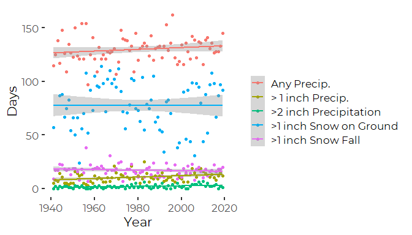

Frequency Analyses of Weather Events
================
Curtis C. Bohlen, Casco Bay Estuary Partnership
11/09/2021

-   [Introduction](#introduction)
-   [Install Libraries](#install-libraries)
    -   [Read Data](#read-data)
-   [Temperature Exceedences](#temperature-exceedences)
    -   [Generalized Linear Models](#generalized-linear-models)
        -   [Poisson Models](#poisson-models)
        -   [Other Models](#other-models)
        -   [Compare Model Trend Lines](#compare-model-trend-lines)
-   [Precipitation Frequencies](#precipitation-frequencies)
    -   [Load Data](#load-data)
    -   [Poisson Generalized Linear
        Models](#poisson-generalized-linear-models)
        -   [Days with Any Precipitation](#days-with-any-precipitation)
        -   [Data with More than One Inch of
            Rainfall](#data-with-more-than-one-inch-of-rainfall)
        -   [Data with More than Two Inches of
            Rainfall](#data-with-more-than-two-inches-of-rainfall)
-   [Days with snow](#days-with-snow)
    -   [Poisson GLMs](#poisson-glms)
    -   [Days with Snowfall](#days-with-snowfall)
-   [Days With Snow on the Ground](#days-with-snow-on-the-ground)
-   [2 inches of rain in 48 hours - -Note reaily
    possible](#2-inches-of-rain-in-48-hours----note-reaily-possible)
-   [Net Changes](#net-changes)


# Introduction

This R Notebook contains code analyzing weather data from the Portland
Jetport for inclusion in the 2020 State of the Bay Report. The primary
focus in on statistical models, but selected graphics are included to
aid interpretation.

This R Notebook focuses on long-term (80 year) changes in frequency of
extreme events, including cold days, hot days, and high rainfall days.

# Install Libraries

``` r
library(tidyverse)
#> Warning: package 'tidyverse' was built under R version 4.0.5
#> -- Attaching packages --------------------------------------- tidyverse 1.3.1 --
#> v ggplot2 3.3.5     v purrr   0.3.4
#> v tibble  3.1.4     v dplyr   1.0.7
#> v tidyr   1.1.3     v stringr 1.4.0
#> v readr   2.0.1     v forcats 0.5.1
#> Warning: package 'ggplot2' was built under R version 4.0.5
#> Warning: package 'tibble' was built under R version 4.0.5
#> Warning: package 'tidyr' was built under R version 4.0.5
#> Warning: package 'readr' was built under R version 4.0.5
#> Warning: package 'dplyr' was built under R version 4.0.5
#> Warning: package 'forcats' was built under R version 4.0.5
#> -- Conflicts ------------------------------------------ tidyverse_conflicts() --
#> x dplyr::filter() masks stats::filter()
#> x dplyr::lag()    masks stats::lag()
library(readr)
library(ggthemes)
#> Warning: package 'ggthemes' was built under R version 4.0.5
library(CBEPgraphics)
load_cbep_fonts()
theme_set(theme_cbep())
```

## Read Data

``` r
sibfldnm <- 'Data'
parent <- dirname(getwd())
sibling <- paste(parent,sibfldnm, sep = '/')
fn <- 'longannualdata.csv'

longannualdata <- read_csv(paste(sibling,fn, sep = '/')) %>%
  select(-station) %>%
  mutate(year = as.numeric(format(date, format='%Y'))) %>%
  mutate(cyear = year-1980)
#> Rows: 2981 Columns: 5
#> -- Column specification --------------------------------------------------------
#> Delimiter: ","
#> chr  (3): datatype, attributes, station
#> dbl  (1): value
#> dttm (1): date
#> 
#> i Use `spec()` to retrieve the full column specification for this data.
#> i Specify the column types or set `show_col_types = FALSE` to quiet this message.
```

# Temperature Exceedences

The Annual Data Downloaded from NOAA’s Climate Data Online includes
counts of the number of days exceeding various temperature thresholds,
as follows:

1.  DX90: Number of days with maximum temperature &gt;= 32.2°C/90°F.
2.  DX70: Number of days with maximum temperature &gt;= 21.1°C/70°F.
3.  DX32: Number of days with maximum temperature &lt;= 0°C/32°F.
4.  DT32: Number of days with minimum temperature &lt;= 0°C/32°F.
5.  DT00: Number of days with minimum temperature &lt;= -17.8°C/0°F.

We focus on days that got over over 90 Fahrenheit, days that dropped
below 32, and days that got as low as 0 degrees F. Notice that even
though the CDO data was downloaded in metric units, these cumulative
counts are based on English units.

``` r
textdatalong <- longannualdata %>%
  filter(datatype %in% c('DX90', 'DT32', 'DT00'))

textdata <- longannualdata %>%
  filter(datatype %in% c('DX90', 'DT32', 'DT00')) %>%
  spread(key = datatype, value = value)

# The following is to test binomial GLMs
doy <- tibble(year = 1941:2019, days = rep(365, 2020-1941)) %>%
mutate(days = ifelse((year %% 4 == 0) & (year!=2000), 366, 365))

textdata <- textdata %>%
  mutate(days = doy$days)
```

## Generalized Linear Models

These are count data, suggesting either Poisson or binomial models.
Technically, since the total number of days in a year is limited (to 365
days – 366 for leap years), a binomial GLM might be considered correct,
but for low counts, (as observed for most of these variables) the
difference is immaterial, and the assumptions of a Poisson model are
adequately met. For high counts, a binomial distribution will converge
on a normal distribution, suggesting a standard linear model.

Several variables show evidence of over-dispersion compared to a Poisson
model, which suggests looking at quasi-Poisson models.

The Poisson Models are convenient in this setting because the canonical
link for the Poisson model is log, which is easier to work with in this
setting than the canonical link for binomial GLMs (logistic).

### Poisson Models

``` r
gt90GLM <- glm(DX90 ~ year, family = poisson, data = textdata)
lt32GLM <- glm(DT32 ~ year, family = poisson, data = textdata)
lt00GLM <- glm(DT00 ~ year, family = poisson, data = textdata)

gt90GLM_q <- glm(DX90 ~ year, family = quasipoisson, data = textdata)
lt32GLM_q <- glm(DT32 ~ year, family = quasipoisson, data = textdata)
lt00GLM_q <- glm(DT00 ~ year, family = quasipoisson, data = textdata)
```

### Other Models

Here we try binomial and Gaussian models, on the days less than freezing
data, to examine whether it is likely that selection of models would
have any effect on our conclusions.

``` r
#Set up response variable for binomial model
rDT32 <- cbind(textdata$DT32, textdata$days-textdata$DT32)

lt32GLM_b <- glm(rDT32 ~ year, family = binomial, data = textdata)
lt32LM <- lm(DT32 ~ year, data = textdata)
```

### Compare Model Trend Lines

``` r
logit <- function (p) {log(p/(1-p))}
logistic <- function (p) {exp(p)/(exp(p)+1)}
lines <- tibble(cyr = seq(1941,2019),
          lt32_p = exp(coef(lt32GLM)[1] + coef(lt32GLM)[2] * seq(1941,2019) ),
          lt32_b = 365*logistic(coef(lt32GLM_b)[1] + coef(lt32GLM_b)[2]  * seq(1941,2019) ),
          lt32_l = coef(lt32LM)[1] + coef(lt32LM)[2]*seq(1941,2019) )

plt <- ggplot(textdata, aes(x=year))+
  geom_point(aes(y=DT32)) +
  geom_line(data = lines, aes(x=cyr, y=lt32_p), lty=2, color='blue') +
  geom_line(data = lines, aes(x=cyr, y=lt32_b), lty=2, color='green') +
  geom_line(data = lines, aes(x=cyr, y=lt32_l), lty=2, color='red') +

  xlab('Year') +
  ylab("Days")
plt
```


So, all three models provide nearly identical predictions and
qualitative conclusions. Thus model selection here is largely
immaterial. We focus on the Poisson models.

#### Greater than 90 Degree Days

``` r
summary(gt90GLM)
#> 
#> Call:
#> glm(formula = DX90 ~ year, family = poisson, data = textdata)
#> 
#> Deviance Residuals: 
#>     Min       1Q   Median       3Q      Max  
#> -3.2533  -1.4081  -0.2842   1.0077   3.6799  
#> 
#> Coefficients:
#>              Estimate Std. Error z value Pr(>|z|)  
#> (Intercept)  7.554640   4.360787   1.732   0.0832 .
#> year        -0.003001   0.002204  -1.362   0.1733  
#> ---
#> Signif. codes:  0 '***' 0.001 '**' 0.01 '*' 0.05 '.' 0.1 ' ' 1
#> 
#> (Dispersion parameter for poisson family taken to be 1)
#> 
#>     Null deviance: 216.87  on 78  degrees of freedom
#> Residual deviance: 215.01  on 77  degrees of freedom
#> AIC: 462.56
#> 
#> Number of Fisher Scoring iterations: 5
summary(gt90GLM_q)
#> 
#> Call:
#> glm(formula = DX90 ~ year, family = quasipoisson, data = textdata)
#> 
#> Deviance Residuals: 
#>     Min       1Q   Median       3Q      Max  
#> -3.2533  -1.4081  -0.2842   1.0077   3.6799  
#> 
#> Coefficients:
#>              Estimate Std. Error t value Pr(>|t|)
#> (Intercept)  7.554640   6.949191   1.087    0.280
#> year        -0.003001   0.003512  -0.855    0.395
#> 
#> (Dispersion parameter for quasipoisson family taken to be 2.539445)
#> 
#>     Null deviance: 216.87  on 78  degrees of freedom
#> Residual deviance: 215.01  on 77  degrees of freedom
#> AIC: NA
#> 
#> Number of Fisher Scoring iterations: 5
```

So no increase in number of days exceeding 90 degrees. Quasi-Poisson
addresses the elevated residual deviance, increasing standard errors,
but does not change the conclusions.

#### Days Freezing

``` r
summary(lt32GLM)
#> 
#> Call:
#> glm(formula = DT32 ~ year, family = poisson, data = textdata)
#> 
#> Deviance Residuals: 
#>      Min        1Q    Median        3Q       Max  
#> -1.96864  -0.56933   0.09762   0.59788   1.64587  
#> 
#> Coefficients:
#>               Estimate Std. Error z value Pr(>|z|)    
#> (Intercept)  9.2925229  0.7907057  11.752  < 2e-16 ***
#> year        -0.0021541  0.0003995  -5.391 6.99e-08 ***
#> ---
#> Signif. codes:  0 '***' 0.001 '**' 0.01 '*' 0.05 '.' 0.1 ' ' 1
#> 
#> (Dispersion parameter for poisson family taken to be 1)
#> 
#>     Null deviance: 78.907  on 78  degrees of freedom
#> Residual deviance: 49.819  on 77  degrees of freedom
#> AIC: 596.09
#> 
#> Number of Fisher Scoring iterations: 3
summary(lt32GLM_q)
#> 
#> Call:
#> glm(formula = DT32 ~ year, family = quasipoisson, data = textdata)
#> 
#> Deviance Residuals: 
#>      Min        1Q    Median        3Q       Max  
#> -1.96864  -0.56933   0.09762   0.59788   1.64587  
#> 
#> Coefficients:
#>               Estimate Std. Error t value Pr(>|t|)    
#> (Intercept)  9.2925229  0.6339237  14.659  < 2e-16 ***
#> year        -0.0021541  0.0003203  -6.725 2.75e-09 ***
#> ---
#> Signif. codes:  0 '***' 0.001 '**' 0.01 '*' 0.05 '.' 0.1 ' ' 1
#> 
#> (Dispersion parameter for quasipoisson family taken to be 0.6427531)
#> 
#>     Null deviance: 78.907  on 78  degrees of freedom
#> Residual deviance: 49.819  on 77  degrees of freedom
#> AIC: NA
#> 
#> Number of Fisher Scoring iterations: 3
```

We see significant declines in the number of days dipping below
freezing. The quasipoisson model identifies slight under-dispersion, but
that does not change the underlying conclusions.

##### Model Diagnostics

``` r
oldpar <- par(mfrow= c(2,2))
plot(lt32GLM)
```


``` r
par(oldpar)
```

We see no consequential deviations from model assumptions, although
residuals show modest deviations from expectations.

#### Days Less Than Zero

``` r
summary(lt00GLM)
#> 
#> Call:
#> glm(formula = DT00 ~ year, family = poisson, data = textdata)
#> 
#> Deviance Residuals: 
#>     Min       1Q   Median       3Q      Max  
#> -4.4480  -1.2130  -0.3404   1.0691   3.5683  
#> 
#> Coefficients:
#>              Estimate Std. Error z value Pr(>|z|)    
#> (Intercept) 32.810472   3.005859   10.92   <2e-16 ***
#> year        -0.015379   0.001524  -10.09   <2e-16 ***
#> ---
#> Signif. codes:  0 '***' 0.001 '**' 0.01 '*' 0.05 '.' 0.1 ' ' 1
#> 
#> (Dispersion parameter for poisson family taken to be 1)
#> 
#>     Null deviance: 371.27  on 78  degrees of freedom
#> Residual deviance: 265.70  on 77  degrees of freedom
#> AIC: 585.16
#> 
#> Number of Fisher Scoring iterations: 5
summary(lt00GLM_q)
#> 
#> Call:
#> glm(formula = DT00 ~ year, family = quasipoisson, data = textdata)
#> 
#> Deviance Residuals: 
#>     Min       1Q   Median       3Q      Max  
#> -4.4480  -1.2130  -0.3404   1.0691   3.5683  
#> 
#> Coefficients:
#>              Estimate Std. Error t value Pr(>|t|)    
#> (Intercept) 32.810472   5.420854   6.053 4.84e-08 ***
#> year        -0.015379   0.002748  -5.595 3.23e-07 ***
#> ---
#> Signif. codes:  0 '***' 0.001 '**' 0.01 '*' 0.05 '.' 0.1 ' ' 1
#> 
#> (Dispersion parameter for quasipoisson family taken to be 3.252358)
#> 
#>     Null deviance: 371.27  on 78  degrees of freedom
#> Residual deviance: 265.70  on 77  degrees of freedom
#> AIC: NA
#> 
#> Number of Fisher Scoring iterations: 5
```

Highly significant decrease in days dropping below zero. QuasiPoisson
addresses moderate over-dispersion, but does not change the substantive
conclusions. We prefer the quasi poison model here, as slightly more
conservative.

For plotting purposes, note that all model parameters are identical
between Poisson and Quasi-Poisson models. It is only the dispersion that
differs.

# Precipitation Frequencies

DP01: Number of days with &gt;= 0.01 inch/0.254 millimeter in the month
(year). DP10: Number of days with &gt;= 0.1 inch/2.54 millimeter in the
month (year). DP1X: Number of days with &gt;= 1.0 inch (25.4mm)
precipitation in the month (year). DSNW: Number of days with snowfall
&gt;= 1 inch (25 mm). DSND: Number of days with snow depth &gt;= 1 inch
(25 mm).

Note this does not include the number of days with more than two inches
of rain, which is arguably a better metric of intense storms than the
one inch rain threshold. That needs to be derived from the daily data.

## Load Data

``` r
pextdata <- longannualdata %>%
  filter(datatype %in% c('DP01', 'DP1X', 'DSNW', 'DSND')) %>%
  select(-attributes) %>%
  spread(key = datatype, value = value)

# Days with two inches of rain or more
fn <- 'longdailydata.csv'

num2inch <- 
  # Read daily data
  read_csv(paste(sibling,fn, sep = '/')) %>%
  select(-station) %>%
  mutate(year = as.numeric(format(date, format='%Y')))  %>%
  select(date,year, datatype, value) %>%
  # Filter down to only precipitation data
  filter(datatype=='PRCP') %>%
  rename(PRCP = value) %>%
  filter( ! is.na(PRCP)) %>%
  # Convert to inches. Original data in tenths of mm
  mutate(PRCP_IN = PRCP * 0.0393700787 / 10) %>% 
  filter(year > 1940) %>%       # 1940 is an incomplete year in the daily data
  
  # And count the number of high rain events
  filter(PRCP_IN >= 2) %>%    # Only days with two inches of rain or more
  group_by(year) %>%
  summarise(COUNT = n())      # use all caps because "count" is a builtin function
#> Rows: 370361 Columns: 5
#> -- Column specification --------------------------------------------------------
#> Delimiter: ","
#> chr  (3): datatype, attributes, station
#> dbl  (1): value
#> dttm (1): date
#> 
#> i Use `spec()` to retrieve the full column specification for this data.
#> i Specify the column types or set `show_col_types = FALSE` to quiet this message.
## This will be wrong for years that have no large storms, since the Year will  
## get dropped.  We want years with zero intense storms to be included in the 
## data with the value of zero.  One can fix that using a left_join.

pextdata <- left_join(pextdata, num2inch, by='year') %>%
  mutate(COUNT=replace_na(COUNT,0)) %>%
  rename(DP2X = COUNT) %>%
  mutate(cyear = year-1980)

pextdatalong <- pextdata %>%
  gather(key='datatype', value = 'value', -date, -year, -cyear)

rm(sibfldnm, parent, sibling, fn, num2inch)
```

``` r
plt <- ggplot(pextdatalong, aes(x=year, color=datatype))+
  geom_point(aes(y=value)) +
  geom_smooth(aes(y = value), method = 'lm') +
  xlab('Year') +
  ylab("Days") +
  scale_color_discrete(name = '',
                     labels = c('Any Precip.',
                                '> 1 inch Precip.', 
                                 '>2 inch Precipitation', 
                                '>1 inch Snow on Ground',
                                '>1 inch Snow Fall'))
plt
#> `geom_smooth()` using formula 'y ~ x'
#> Warning: Removed 6 rows containing non-finite values (stat_smooth).
#> Warning: Removed 6 rows containing missing values (geom_point).
```


Those look crappy all on one graph… But only those with large storms are
statistically significant.

## Poisson Generalized Linear Models

``` r
gt0GLM <- glm(DP01 ~ year, family = poisson, data = pextdata)
gt1GLM <- glm(DP1X ~ year, family = poisson, data = pextdata)
gt2GLM <- glm(DP2X ~ year, family = poisson, data = pextdata)

gt0GLM_q <- glm(DP01 ~ year, family = quasipoisson, data = pextdata)
gt1GLM_q <- glm(DP1X ~ year, family = quasipoisson, data = pextdata)
gt2GLM_q <- glm(DP2X ~ year, family = quasipoisson, data = pextdata)
```

### Days with Any Precipitation

``` r
summary(gt0GLM)
#> 
#> Call:
#> glm(formula = DP01 ~ year, family = poisson, data = pextdata)
#> 
#> Deviance Residuals: 
#>      Min        1Q    Median        3Q       Max  
#> -2.86437  -0.65724  -0.04897   0.53726   2.59230  
#> 
#> Coefficients:
#>              Estimate Std. Error z value Pr(>|z|)    
#> (Intercept) 3.6143128  0.8573843   4.216 2.49e-05 ***
#> year        0.0006325  0.0004329   1.461    0.144    
#> ---
#> Signif. codes:  0 '***' 0.001 '**' 0.01 '*' 0.05 '.' 0.1 ' ' 1
#> 
#> (Dispersion parameter for poisson family taken to be 1)
#> 
#>     Null deviance: 83.970  on 78  degrees of freedom
#> Residual deviance: 81.835  on 77  degrees of freedom
#> AIC: 615.28
#> 
#> Number of Fisher Scoring iterations: 4
summary(gt0GLM_q)
#> 
#> Call:
#> glm(formula = DP01 ~ year, family = quasipoisson, data = pextdata)
#> 
#> Deviance Residuals: 
#>      Min        1Q    Median        3Q       Max  
#> -2.86437  -0.65724  -0.04897   0.53726   2.59230  
#> 
#> Coefficients:
#>              Estimate Std. Error t value Pr(>|t|)    
#> (Intercept) 3.6143128  0.8851796   4.083 0.000108 ***
#> year        0.0006325  0.0004470   1.415 0.161067    
#> ---
#> Signif. codes:  0 '***' 0.001 '**' 0.01 '*' 0.05 '.' 0.1 ' ' 1
#> 
#> (Dispersion parameter for quasipoisson family taken to be 1.065888)
#> 
#>     Null deviance: 83.970  on 78  degrees of freedom
#> Residual deviance: 81.835  on 77  degrees of freedom
#> AIC: NA
#> 
#> Number of Fisher Scoring iterations: 4
```

No statistically significant trend in days with measurable rainfall.

### Data with More than One Inch of Rainfall

``` r
summary(gt1GLM)
#> 
#> Call:
#> glm(formula = DP1X ~ year, family = poisson, data = pextdata)
#> 
#> Deviance Residuals: 
#>     Min       1Q   Median       3Q      Max  
#> -2.3552  -1.1012  -0.2469   0.7783   3.7102  
#> 
#> Coefficients:
#>               Estimate Std. Error z value Pr(>|z|)    
#> (Intercept) -10.127037   3.019598  -3.354 0.000797 ***
#> year          0.006303   0.001522   4.140 3.47e-05 ***
#> ---
#> Signif. codes:  0 '***' 0.001 '**' 0.01 '*' 0.05 '.' 0.1 ' ' 1
#> 
#> (Dispersion parameter for poisson family taken to be 1)
#> 
#>     Null deviance: 141.57  on 78  degrees of freedom
#> Residual deviance: 124.32  on 77  degrees of freedom
#> AIC: 454.67
#> 
#> Number of Fisher Scoring iterations: 4
summary(gt1GLM_q)
#> 
#> Call:
#> glm(formula = DP1X ~ year, family = quasipoisson, data = pextdata)
#> 
#> Deviance Residuals: 
#>     Min       1Q   Median       3Q      Max  
#> -2.3552  -1.1012  -0.2469   0.7783   3.7102  
#> 
#> Coefficients:
#>               Estimate Std. Error t value Pr(>|t|)   
#> (Intercept) -10.127037   3.937672  -2.572  0.01204 * 
#> year          0.006303   0.001985   3.175  0.00216 **
#> ---
#> Signif. codes:  0 '***' 0.001 '**' 0.01 '*' 0.05 '.' 0.1 ' ' 1
#> 
#> (Dispersion parameter for quasipoisson family taken to be 1.700516)
#> 
#>     Null deviance: 141.57  on 78  degrees of freedom
#> Residual deviance: 124.32  on 77  degrees of freedom
#> AIC: NA
#> 
#> Number of Fisher Scoring iterations: 4
```

So, a statistically significant increase in days with one inch or more
of rain.

``` r
oldpar <- par(mfrow= c(2,2))
plot(gt1GLM)
```


``` r
par(oldpar)
```

Nothing scary in there, but there are a few outliers, and in general the
extremes are wider than expected. Still, the trend is strong, so these
relativley mild deviations from assumptions are not likely to matter for
out qualitative conclusions.

### Data with More than Two Inches of Rainfall

``` r
summary(gt2GLM)
#> 
#> Call:
#> glm(formula = DP2X ~ year, family = poisson, data = pextdata)
#> 
#> Deviance Residuals: 
#>     Min       1Q   Median       3Q      Max  
#> -2.4834  -0.8025  -0.2778   0.6879   2.3215  
#> 
#> Coefficients:
#>               Estimate Std. Error z value Pr(>|z|)    
#> (Intercept) -26.076564   7.197097  -3.623 0.000291 ***
#> year          0.013487   0.003622   3.723 0.000197 ***
#> ---
#> Signif. codes:  0 '***' 0.001 '**' 0.01 '*' 0.05 '.' 0.1 ' ' 1
#> 
#> (Dispersion parameter for poisson family taken to be 1)
#> 
#>     Null deviance: 116.01  on 78  degrees of freedom
#> Residual deviance: 101.75  on 77  degrees of freedom
#> AIC: 276.14
#> 
#> Number of Fisher Scoring iterations: 5
summary(gt2GLM_q)
#> 
#> Call:
#> glm(formula = DP2X ~ year, family = quasipoisson, data = pextdata)
#> 
#> Deviance Residuals: 
#>     Min       1Q   Median       3Q      Max  
#> -2.4834  -0.8025  -0.2778   0.6879   2.3215  
#> 
#> Coefficients:
#>               Estimate Std. Error t value Pr(>|t|)    
#> (Intercept) -26.076564   7.675873  -3.397 0.001080 ** 
#> year          0.013487   0.003863   3.491 0.000799 ***
#> ---
#> Signif. codes:  0 '***' 0.001 '**' 0.01 '*' 0.05 '.' 0.1 ' ' 1
#> 
#> (Dispersion parameter for quasipoisson family taken to be 1.137472)
#> 
#>     Null deviance: 116.01  on 78  degrees of freedom
#> Residual deviance: 101.75  on 77  degrees of freedom
#> AIC: NA
#> 
#> Number of Fisher Scoring iterations: 5
```

So highly statistically significant changes in days with two inches of
rain too.

``` r
oldpar <- par(mfrow= c(2,2))
plot(gt2GLM)
```


``` r
par(oldpar)
```

This model is pretty solid.

# Days with snow

## Poisson GLMs

``` r
snowgfallGLM <- glm(DSNW ~ year, family = poisson, data = pextdata)
snowgdepGLM <- glm(DSND ~ year, family = poisson, data = pextdata)
snowgfallGLM_q <- glm(DSNW ~ year, family = quasipoisson, data = pextdata)
snowgdepGLM_q <- glm(DSND ~ year, family = quasipoisson, data = pextdata)
```

## Days with Snowfall

``` r
summary(snowgfallGLM)
#> 
#> Call:
#> glm(formula = DSNW ~ year, family = poisson, data = pextdata)
#> 
#> Deviance Residuals: 
#>     Min       1Q   Median       3Q      Max  
#> -2.8939  -0.7423   0.0129   0.5499   4.1803  
#> 
#> Coefficients:
#>              Estimate Std. Error z value Pr(>|z|)  
#> (Intercept)  5.913554   2.373163   2.492   0.0127 *
#> year        -0.001554   0.001199  -1.296   0.1949  
#> ---
#> Signif. codes:  0 '***' 0.001 '**' 0.01 '*' 0.05 '.' 0.1 ' ' 1
#> 
#> (Dispersion parameter for poisson family taken to be 1)
#> 
#>     Null deviance: 120.15  on 77  degrees of freedom
#> Residual deviance: 118.47  on 76  degrees of freedom
#>   (1 observation deleted due to missingness)
#> AIC: 484.25
#> 
#> Number of Fisher Scoring iterations: 4
summary(snowgfallGLM_q)
#> 
#> Call:
#> glm(formula = DSNW ~ year, family = quasipoisson, data = pextdata)
#> 
#> Deviance Residuals: 
#>     Min       1Q   Median       3Q      Max  
#> -2.8939  -0.7423   0.0129   0.5499   4.1803  
#> 
#> Coefficients:
#>              Estimate Std. Error t value Pr(>|t|)  
#> (Intercept)  5.913554   2.964930   1.994   0.0497 *
#> year        -0.001554   0.001498  -1.038   0.3028  
#> ---
#> Signif. codes:  0 '***' 0.001 '**' 0.01 '*' 0.05 '.' 0.1 ' ' 1
#> 
#> (Dispersion parameter for quasipoisson family taken to be 1.560896)
#> 
#>     Null deviance: 120.15  on 77  degrees of freedom
#> Residual deviance: 118.47  on 76  degrees of freedom
#>   (1 observation deleted due to missingness)
#> AIC: NA
#> 
#> Number of Fisher Scoring iterations: 4
```

Days with snowfall have not changed.

# Days With Snow on the Ground

``` r
summary(snowgdepGLM)
#> 
#> Call:
#> glm(formula = DSND ~ year, family = poisson, data = pextdata)
#> 
#> Deviance Residuals: 
#>     Min       1Q   Median       3Q      Max  
#> -7.1454  -1.8014   0.2248   2.1050   3.8495  
#> 
#> Coefficients:
#>               Estimate Std. Error z value Pr(>|z|)    
#> (Intercept)  4.482e+00  1.164e+00   3.850 0.000118 ***
#> year        -6.565e-05  5.877e-04  -0.112 0.911056    
#> ---
#> Signif. codes:  0 '***' 0.001 '**' 0.01 '*' 0.05 '.' 0.1 ' ' 1
#> 
#> (Dispersion parameter for poisson family taken to be 1)
#> 
#>     Null deviance: 492.67  on 73  degrees of freedom
#> Residual deviance: 492.66  on 72  degrees of freedom
#>   (5 observations deleted due to missingness)
#> AIC: 951.27
#> 
#> Number of Fisher Scoring iterations: 4
summary(snowgdepGLM_q)
#> 
#> Call:
#> glm(formula = DSND ~ year, family = quasipoisson, data = pextdata)
#> 
#> Deviance Residuals: 
#>     Min       1Q   Median       3Q      Max  
#> -7.1454  -1.8014   0.2248   2.1050   3.8495  
#> 
#> Coefficients:
#>               Estimate Std. Error t value Pr(>|t|)
#> (Intercept)  4.482e+00  2.934e+00   1.528    0.131
#> year        -6.565e-05  1.481e-03  -0.044    0.965
#> 
#> (Dispersion parameter for quasipoisson family taken to be 6.353678)
#> 
#>     Null deviance: 492.67  on 73  degrees of freedom
#> Residual deviance: 492.66  on 72  degrees of freedom
#>   (5 observations deleted due to missingness)
#> AIC: NA
#> 
#> Number of Fisher Scoring iterations: 4
```

Again, no apparent change in days with snow on the ground. Very noisy
data.  
Highly over-dispersed for a Poisson model. Might be worth exploring
alternative models.

# 2 inches of rain in 48 hours - -Note reaily possible

Paul Hunt asked about a graphic from our 2009 Climate Change Report
showing 2 inches of rain over 48 hours. I believe you would have to
derive that figure from hourly rainfall data, but the data I’ve accessed
has significant gaps and inconsistencies that I have not yet resolved.

# Net Changes

It’s worth looking at what the analyses mean in terms of predicted
values for selected years. This gives us a gauge of “typical” conditions
for each decade, based on all the available data, not just the data from
that decade.

``` r
newdf <- data.frame(year=c(1940, 1950, 1960, 1970, 1980, 1990, 2000, 2010, 2020))
pred <- predict(gt1GLM, newdata=newdf)
cbind(newdf$year, pred, exp(pred))
#>            pred          
#> 1 1940 2.101510  8.178509
#> 2 1950 2.164544  8.710626
#> 3 1960 2.227577  9.277363
#> 4 1970 2.290611  9.880974
#> 5 1980 2.353645 10.523858
#> 6 1990 2.416679 11.208569
#> 7 2000 2.479712 11.937830
#> 8 2010 2.542746 12.714538
#> 9 2020 2.605780 13.541782
```

``` r
pred <- predict(gt2GLM, newdata=newdf)
cbind(newdf$year, pred, exp(pred))
#>              pred         
#> 1 1940 0.08765658 1.091613
#> 2 1950 0.22252370 1.249225
#> 3 1960 0.35739081 1.429594
#> 4 1970 0.49225793 1.636006
#> 5 1980 0.62712505 1.872220
#> 6 1990 0.76199217 2.142540
#> 7 2000 0.89685929 2.451890
#> 8 2010 1.03172641 2.805906
#> 9 2020 1.16659353 3.211036
```

So, days with more than one inch of rain have gone from about eight a
year to about thirteen or fourteen a year. Days with two or more inches
of rain have gone from about one a year to about three a year.
