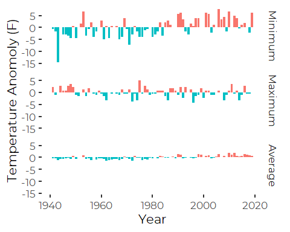
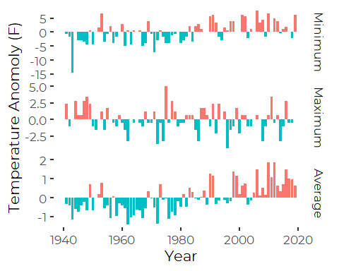
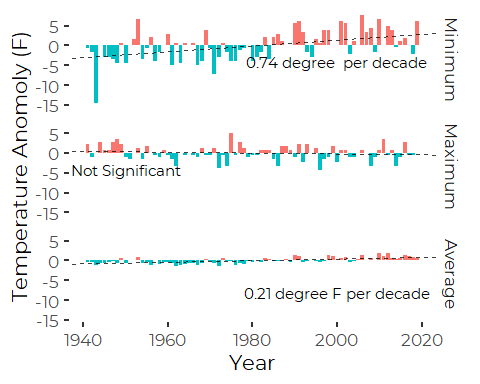
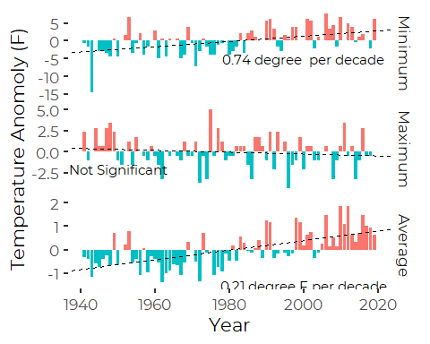

alternative graphics for Portland Jetport Historical Weather Data
================
Curtis C. Bohlen, Casco Bay Estuary Partnership
11/09/2021

-   [Install Libraries](#install-libraries)
-   [Read Data](#read-data)
-   [Annual Minimum, Maximum and Average
    Temperature](#annual-minimum-maximum-and-average-temperature)
    -   [Testing possible Graphics](#testing-possible-graphics)


# Install Libraries

``` r
library(tidyverse)
#> Warning: package 'tidyverse' was built under R version 4.0.5
#> -- Attaching packages --------------------------------------- tidyverse 1.3.1 --
#> v ggplot2 3.3.5     v purrr   0.3.4
#> v tibble  3.1.4     v dplyr   1.0.7
#> v tidyr   1.1.3     v stringr 1.4.0
#> v readr   2.0.1     v forcats 0.5.1
#> Warning: package 'ggplot2' was built under R version 4.0.5
#> Warning: package 'tibble' was built under R version 4.0.5
#> Warning: package 'tidyr' was built under R version 4.0.5
#> Warning: package 'readr' was built under R version 4.0.5
#> Warning: package 'dplyr' was built under R version 4.0.5
#> Warning: package 'forcats' was built under R version 4.0.5
#> -- Conflicts ------------------------------------------ tidyverse_conflicts() --
#> x dplyr::filter() masks stats::filter()
#> x dplyr::lag()    masks stats::lag()
library(readr)
library(ggthemes)
#> Warning: package 'ggthemes' was built under R version 4.0.5
library(extrafont)
#> Registering fonts with R
library(CBEPgraphics)
load_cbep_fonts()
theme_set(theme_cbep())
```

# Read Data

``` r
sibfldnm <- 'Data'
parent <- dirname(getwd())
sibling <- paste(parent,sibfldnm, sep = '/')
fn <- 'longannualdata.csv'

longannualdata <- read_csv(paste(sibling,fn, sep = '/')) %>%
  select(-station) %>%
  mutate(year = as.numeric(format(date, format='%Y'))) %>%
  mutate(cyear = year-1980)
#> Rows: 2981 Columns: 5
#> -- Column specification --------------------------------------------------------
#> Delimiter: ","
#> chr  (3): datatype, attributes, station
#> dbl  (1): value
#> dttm (1): date
#> 
#> i Use `spec()` to retrieve the full column specification for this data.
#> i Specify the column types or set `show_col_types = FALSE` to quiet this message.
```

Making sense of that data requires looking at the metadata, but here’s a
list of the datatypes included.

``` r
levels(factor(longannualdata$datatype))
#>  [1] "AWND" "CDSD" "CLDD" "DP01" "DP10" "DP1X" "DSND" "DSNW" "DT00" "DT32"
#> [11] "DX32" "DX70" "DX90" "EMNT" "EMSD" "EMSN" "EMXP" "EMXT" "FZF0" "FZF1"
#> [21] "FZF2" "FZF3" "FZF4" "FZF5" "FZF6" "FZF7" "FZF8" "FZF9" "HDSD" "HTDD"
#> [31] "PRCP" "PSUN" "SNOW" "TAVG" "TMAX" "TMIN" "TSUN" "WDF1" "WDF2" "WDF5"
#> [41] "WDFG" "WDFM" "WSF1" "WSF2" "WSF5" "WSFG" "WSFM"
```

And their frequencies. Most data records are available for all years, A
handful, mostly wind related, are inly available more recently.

``` r
longannualdata %>%
  group_by(datatype) %>%
  summarize(n=n())
#> # A tibble: 47 x 2
#>    datatype     n
#>    <chr>    <int>
#>  1 AWND        36
#>  2 CDSD        79
#>  3 CLDD        79
#>  4 DP01        79
#>  5 DP10        79
#>  6 DP1X        79
#>  7 DSND        74
#>  8 DSNW        78
#>  9 DT00        79
#> 10 DT32        79
#> # ... with 37 more rows
```

# Annual Minimum, Maximum and Average Temperature

Codes for Key Temperature records in the downloaded annual data are: \*
TAVG – Annual Average Temperature (unweighted; effectively average of
monthly averages, of daily maxes and mins. Note that this means this is
not independent of the other two metrics.) \* EMXT – Extreme Maximum
Annual Temperature \* EMNT – Extreme Minimum Temperature

Note that in 2015 State of the Bay, we calculated our own annual means,
mins and maxes from the daily records.

## Testing possible Graphics

That graphic is not very satisfying, as the slopes are difficult to
perceive. I wonder if it might be better to present these as temperature
anomolies, either from a designated year or from the long term averages.

``` r
tdata.centered <- longannualdata %>%
  filter(datatype %in% c('TAVG', 'EMXT', 'EMNT')) %>%
  select(-attributes) %>%
  spread(key = datatype, value = value) %>%
  mutate_at(c('TAVG', 'EMXT', 'EMNT'), ~ scale(., scale = FALSE)) %>%
  gather(key = 'datatype', value = 'value', -date, -year, -cyear)
#> Warning: attributes are not identical across measure variables;
#> they will be dropped
```

geom\_smooth() provides a linear model, which is not robust to outliers.
It looks like we have only one major outlier, that very cold winter in
about 1943. Also, I really don’t want the non statistically significant
slope on maximum temperature to show.

So, lets fit linear models and add statistically significant ones to the
plot

``` r
tdata.centered.wide <- tdata.centered %>%
  spread(key = datatype, value = value)
mean.lm <- lm(TAVG~ cyear, data = tdata.centered.wide)
min.lm <- lm(EMNT~ cyear, data = tdata.centered.wide)
max.lm <- lm(EMXT~ cyear, data = tdata.centered.wide)
```

Statistical significance of slope estimates should not change based on
centering, so we don’t need to review model results. What should change
here is simply the paramaterization – especially the value of the
intercepts. Code here also relabels the x axis to show years, not
“centered years.”

Can also fill in anomalies with different colors, as follows. ()

``` r
type.labs <- c('Maximum', 'Average', 'Minimum')
names(type.labs) <- c("EMXT", "TAVG", "EMNT")


plt1 <- ggplot(tdata.centered, aes(year, value)) + 
  geom_bar(aes(fill = ifelse(value <0, "red4", "blue")),
           stat = "identity",
           position = "identity") +
  theme_cbep() +
  ggplot2::scale_fill_discrete(name = '', 
                               labels = c('Above Average', 'Below Average')) +
  xlab('Year') +
  ylab('Temperature Anomoly (F)') +
  facet_wrap('datatype', nrow=3, scales = 'fixed', # alternative is "free_y"
             labeller = labeller(datatype = type.labs),
             strip.position = 'right') +
  theme(legend.position = "none")
plt1
```



``` r
plt2 <- ggplot(tdata.centered, aes(year, value)) + 
  geom_bar(aes(fill = ifelse(value <0, 
                             "Below Average", 
                             "Above Average")),
           stat = "identity",
           position = "identity") +
  theme_cbep() +
  scale_fill_discrete(name = '', 
                      labels = c('Above Average', 'Below Average')) +
  xlab('Year') +
  ylab('Temperature Anomoly (F)') +
  facet_wrap('datatype', nrow=3, scales = 'free_y', # alternative is "fixed"
             labeller = labeller(datatype = type.labs),
             strip.position = 'right') +
  theme(legend.position = "none")
plt2
```



``` r
lines <- tibble(datatype = c("EMXT", "TAVG", "EMNT"),
               theslope = c(max.lm$coef[2], mean.lm$coef[2], min.lm$coef[2]),
               theintercept = c(max.lm$coef[1] - 1980 *max.lm$coef[2],
                                mean.lm$coef[1] - 1980 *mean.lm$coef[2],
                                min.lm$coef[1] - 1980 *min.lm$coef[2]))

labs <-  tibble(datatype = c("EMXT", "TAVG", "EMNT"),
              ypos1 = c(-4, -8, -4),
              ypos2 = c(-2, -1.5, -5),
              xpos = c(1950, 2000, 2000),
              txt = c("Not Significant",
                       paste(round(mean.lm$coef[2]*10,2), 
                             'degree F', 
                             "per decade"),
                       paste(round(min.lm$coef[2]*10,2), 
                             'degree ', 
                             "per decade"))
)
```

``` r
plt1 +
  geom_abline(aes(slope = theslope, 
                  intercept = theintercept), 
              data = lines, 
              lty = 2, alpha = 0.75) +
  geom_text(aes(x=xpos, y=ypos1, label=txt), 
            data = labs)
```



``` r
plt2 +
  geom_abline(aes(slope = theslope, 
                  intercept = theintercept), 
              data = lines, 
              lty = 2) +
  geom_text(aes(x=xpos, y=ypos2, label=txt), 
            data = labs)
```



``` r
ggsave('drafttempanomolies.png')
#> Saving 5 x 4 in image
```

Not clear which is better…. Note that in 2015 State of the Bay, we
calculated our own annual means, mins and maxes from the daily records.
