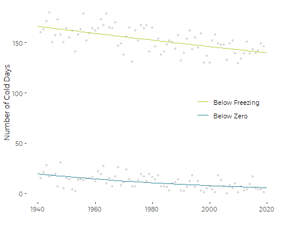
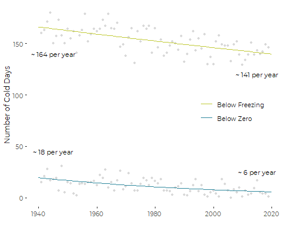
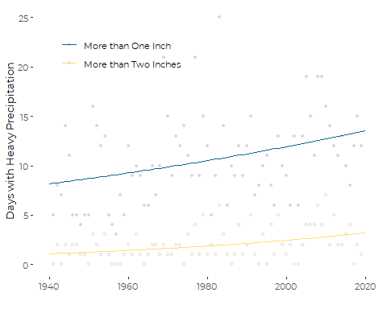
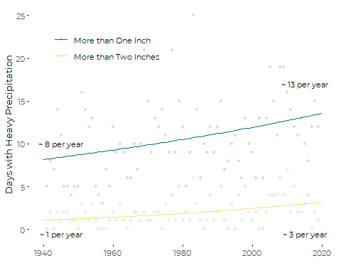

Graphics for Frequencies of Extreme Weather
================
Curtis C. Bohlen, Casco Bay Estuary Partnership.
11/10/2021

-   [Install Libraries](#install-libraries)
-   [Temperature Exeedences](#temperature-exeedences)
    -   [Read Data](#read-data)
    -   [Poisson Models](#poisson-models)
    -   [Plotting](#plotting)
        -   [Basic Graphic](#basic-graphic)
        -   [Add Annotations](#add-annotations)
-   [Precipitation Frequencies](#precipitation-frequencies)
    -   [Read Data](#read-data-1)
    -   [Poisson Models](#poisson-models-1)
    -   [Plotting](#plotting-1)
        -   [Add Annotations](#add-annotations-1)


# Install Libraries

``` r
library(tidyverse)
#> Warning: package 'tidyverse' was built under R version 4.0.5
#> -- Attaching packages --------------------------------------- tidyverse 1.3.1 --
#> v ggplot2 3.3.5     v purrr   0.3.4
#> v tibble  3.1.6     v dplyr   1.0.7
#> v tidyr   1.1.4     v stringr 1.4.0
#> v readr   2.1.0     v forcats 0.5.1
#> Warning: package 'ggplot2' was built under R version 4.0.5
#> Warning: package 'tidyr' was built under R version 4.0.5
#> Warning: package 'dplyr' was built under R version 4.0.5
#> Warning: package 'forcats' was built under R version 4.0.5
#> -- Conflicts ------------------------------------------ tidyverse_conflicts() --
#> x dplyr::filter() masks stats::filter()
#> x dplyr::lag()    masks stats::lag()
library(readr)

library(CBEPgraphics)
load_cbep_fonts()
theme_set(theme_cbep())
```

# Temperature Exeedences

## Read Data

The Annual Data Downloaded from NOAA’s Climate Data Online includes
counts of the number of days exceeding various temperature thresholds,
as follows:

-   DX90: Number of days with maximum temperature &gt;= 32.2°C/90°F.  
-   DX70: Number of days with maximum temperature &gt;= 21.1°C/70°F.  
-   DX32: Number of days with maximum temperature &lt;= 0°C/32°F.  
-   DT32: Number of days with minimum temperature &lt;= 0°C/32°F.  
-   DT00: Number of days with minimum temperature &lt;= -17.8°C/0°F.

``` r
sibfldnm <- 'Data'
parent <- dirname(getwd())
sibling <- paste(parent,sibfldnm, sep = '/')
fn <- 'longannualdata.csv'

dir.create(file.path(getwd(), 'figures'), showWarnings = FALSE)
```

``` r
longannualdata <- read_csv(paste(sibling,fn, sep = '/')) %>%
  select(-station) %>%
  mutate(year = as.numeric(format(date, format='%Y'))) %>%
  mutate(cyear = year-1980)
#> Rows: 2981 Columns: 5
#> -- Column specification --------------------------------------------------------
#> Delimiter: ","
#> chr  (3): datatype, attributes, station
#> dbl  (1): value
#> dttm (1): date
#> 
#> i Use `spec()` to retrieve the full column specification for this data.
#> i Specify the column types or set `show_col_types = FALSE` to quiet this message.
```

We focus on days that dropped below 32, and days that got as low as 0
degrees F. Notice that even though the CDO data was downloaded in metric
units, these cumulative counts are based on English units.

``` r
textdatalong <- longannualdata %>%
  filter(datatype %in% c('DT32', 'DT00'))

textdata <- longannualdata %>%
  filter(datatype %in% c('DT32', 'DT00')) %>%
  pivot_wider(names_from = datatype, values_from = value)
```

## Poisson Models

Note that while we prefer the quasi-Poisson models for inference, the
predictions of the the Poisson models are identical. They differ only in
dispersion. For plotting purposes, since we don’t show model dispersion
on the plots, the two are functionally identical.

``` r
lt32GLM <- glm(DT32 ~ year, family = poisson, data = textdata)
lt00GLM <- glm(DT00 ~ year, family = poisson, data = textdata)
```

``` r
lines <- tibble(yr = seq(1940,2020),
                lt32 = exp(coef(lt32GLM)[1] + 
                             coef(lt32GLM)[2]  * 
                             seq(1940,2020) ),
                lt00 = exp(coef(lt00GLM)[1] + 
                             coef(lt00GLM)[2]  *
                             seq(1940,2020) ),
                 ) 
lines_df <- lines %>%
  pivot_longer(lt32:lt00, names_to = 'prediction', values_to = 'value') %>%
  mutate(prediction = factor(prediction, levels = c('lt32','lt00')))
```

## Plotting

### Basic Graphic

This graphic differs from the one in SoCB largely by including a legend.

``` r
plt <- ggplot(textdatalong, aes(x=year))+
  geom_point(aes(y=value), color='grey85', size = 1) +
  
  geom_line(data = lines_df, aes(x=yr, y=value, color = prediction)) +
  
  scale_color_manual(values = cbep_colors()[c(4,5)], name = '',
                     labels = c('Below Freezing',
                                'Below Zero')) +

  theme_cbep(base_size = 9) +
  
  theme(legend.position=c(0.80, 0.5)) +
  xlab('') +
  ylab("Number of Cold Days")

plt
```



``` r
ggsave('figures/frequencycolddots.pdf',
       device=cairo_pdf, width = 5, height = 4)
```

### Add Annotations

We need predictions to pull out “typical” values from the 1940s and the
2010s to annotate the plot.

``` r
sel_preds <- data.frame(year=c(1945, 2015))
lt32pred <- predict(lt32GLM, newdata=sel_preds, type='response')
lt00pred <- predict(lt00GLM, newdata=sel_preds, type='response')
(sel_preds <- tibble(year = sel_preds$year,
                 DT32=lt32pred,
                 DT00 =lt00pred))
#> # A tibble: 2 x 3
#>    year  DT32  DT00
#>   <dbl> <dbl> <dbl>
#> 1  1945  164. 18.2 
#> 2  2015  141.  6.19
```

So, assemble a dataframe containing the annotations.

``` r
labs<-tibble(year=c(1945, 2015, 1945, 2015),
             y = c(45,25,140, 120),
            txt= c(paste('~', round(sel_preds$DT00[sel_preds$year == 1945],0), 'per year'),
                    paste('~', round(sel_preds$DT00[sel_preds$year == 2015],0), 'per year'),
                    paste('~', round(sel_preds$DT32[sel_preds$year == 1945],0), 'per year'),
                    paste('~', round(sel_preds$DT32[sel_preds$year == 2015],0), 'per year')))
             
```

``` r
plt +  geom_text(aes(x=year, y=y, label=txt), data = labs, size = 3)
```



``` r
ggsave('figures/frequencycolddots.pdf',
      device=cairo_pdf, width = 5, height = 4)
```

# Precipitation Frequencies

1.  DP01: Number of days with &gt;= 0.01 inch/0.254 millimeter in the
    month (year).
2.  DP10: Number of days with &gt;= 0.1 inch/2.54 millimeter in the
    month (year).
3.  DP1X: Number of days with &gt;= 1.0 inch (25.4mm) precipitation in
    the month (year).
4.  DSNW: Number of days with snowfall &gt;= 1 inch (25 mm). 10.DSND:
    Number of days with snow depth &gt;= 1 inch (25 mm).

We are interested in large rain events, so DP1X from this list. The list
does not include the number of days with more than two inches of rain,
which is arguably a better metric of intense storms than the one inch
rain threshold. Since that is not provided by NOAA directly, it needs to
be derived from the daily data, as we do here.

## Read Data

``` r
pextdata <- longannualdata %>%
  filter(datatype %in% c('DP1X')) %>%
  select(-attributes) %>%
  pivot_wider(names_from = datatype, values_from = value)
```

``` r
# Days with two inches of rain or more
fn <- 'longdailydata.csv'

num2inch <- 
  # Read daily data
  read_csv(paste(sibling,fn, sep = '/')) %>%
  select(-station) %>%
  mutate(year = as.numeric(format(date, format='%Y')))  %>%
  select(date,year, datatype, value) %>%
  
  # Filter down to only precipitation data
  filter(datatype=='PRCP') %>%
  rename(PRCP = value) %>%
  filter( ! is.na(PRCP)) %>%
  
  # Convert to inches. Original data in tenths of mm
  mutate(PRCP_IN = PRCP * 0.0393700787 / 10) %>% 
  filter(year > 1940) %>%   # 1940 is an incomplete year in the daily data
  
  # And count the number of high rain events
  filter(PRCP_IN >= 2) %>%  # Only days with two inches of rain or more
  group_by(year) %>%
  summarise(COUNT = n())    # use all caps because "count" is a builtin function
#> Rows: 370361 Columns: 5
#> -- Column specification --------------------------------------------------------
#> Delimiter: ","
#> chr  (3): datatype, attributes, station
#> dbl  (1): value
#> dttm (1): date
#> 
#> i Use `spec()` to retrieve the full column specification for this data.
#> i Specify the column types or set `show_col_types = FALSE` to quiet this message.
```

So far, this will be wrong for years that have no large storms, since
each Year with no large storms will be dropped from the data frame. We
want years with zero intense storms to be included in the data with a
value of zero. We can fix that using a left\_join to the one inch
rainfall data (which includes all years in the instrumented record).

``` r
pextdata <- left_join(pextdata, num2inch, by='year') %>%
  mutate(COUNT=replace_na(COUNT,0)) %>%
  rename(DP2X = COUNT) %>%
  mutate(cyear = year-1980)

pextdatalong <- pextdata %>%
  pivot_longer(DP1X:DP2X, values_to = 'value', names_to = 'datatype') %>%
  mutate(datatype = factor(datatype, 
                           levels = c('DP1X', 'DP2X')))

rm(num2inch)
```

## Poisson Models

``` r
gt1GLM <- glm(DP1X ~ year, family = poisson, data = pextdata)
gt2GLM <- glm(DP2X ~ year, family = poisson, data = pextdata)
```

``` r
lines <- tibble(yr = seq(1940,2020),
                DP1X = exp(coef(gt1GLM)[1] + 
                             coef(gt1GLM)[2]  * 
                             seq(1940,2020) ),
                DP2X = exp(coef(gt2GLM)[1] + 
                             coef(gt2GLM)[2]  *
                             seq(1940,2020) ),
                 )

lines_df <- lines %>%
  pivot_longer(DP1X:DP2X, names_to = 'prediction', values_to = 'value') %>%
  mutate(prediction = factor(prediction, levels = c('DP1X', 'DP2X')))
```

## Plotting

This graphic is similar to the one used in State of Casco Bay except for
the presence of the legend.

``` r
plt <- pextdatalong %>%
  filter(datatype %in% c('DP1X', 'DP2X')) %>%
  
  ggplot(aes(x=year)) +
  geom_point(aes(y=value, shape = datatype),color='grey85', size = 1) +
  
  
  geom_line(data = lines_df, aes(x=yr, y=value, color = prediction)) +
  
  scale_color_manual(values = cbep_colors(), name = '',
                     labels = c('More than One Inch',
                                'More than Two Inches')) +
  scale_shape_manual(values = c(16, 1), name = '',
                     labels = c('More than One Inch',
                                'More than Two Inches')) +
  
  ylab("Days with Heavy Precipitation") +
  xlab('') +
  
  
  theme_cbep(base_size = 10) +
  theme(legend.position = c(0.25, 0.85))
plt
```



``` r
ggsave('figures/highrainfalldots.pdf',
      device=cairo_pdf, width = 5, height = 4)
```

### Add Annotations

We need to calculate a few summary estimates to include in the graphics.
The following two blocks of code gives us a gauge of “typical”
conditions for each decade, based on all the available data, not just
the data from that decade.

``` r
sel_preds <- data.frame(year=c(1945, 2015))
gt1pred <- predict(gt1GLM, newdata=sel_preds, type='response')
gt2pred <- predict(gt2GLM, newdata=sel_preds, type='response')
(sel_preds <- tibble(year = sel_preds$year, 
                 DP1X = gt1pred,
                 DP2X = gt2pred))
#> # A tibble: 2 x 3
#>    year  DP1X  DP2X
#>   <dbl> <dbl> <dbl>
#> 1  1945  8.44  1.17
#> 2  2015 13.1   3.00
```

So, days with more than one inch of rain have gone from about eight a
year in the 1940s to about thirteen a year in the 2010s. Days with two
or more inches of rain have gone from about one a year to about three a
year.

``` r
labs<-tibble(year=c(1945, 2015, 1945,2015),
             y = c(10, 17,-0.5,-0.5),
             txt= c(paste('~', round(sel_preds$DP1X[sel_preds$year == 1945],0), 'per year'),
                    paste('~', round(sel_preds$DP1X[sel_preds$year == 2015],0), 'per year'),
                    paste('~', round(sel_preds$DP2X[sel_preds$year == 1945],0), 'per year'),
                    paste('~', round(sel_preds$DP2X[sel_preds$year == 2015],0), 'per year')))
```

``` r
plt +  geom_text(aes(x=year, y=y, label=txt), data = labs, size = 3)
```



``` r
ggsave('figures/highrainfalldots_annotations.pdf',
      device=cairo_pdf, width = 5, height = 4)
```
