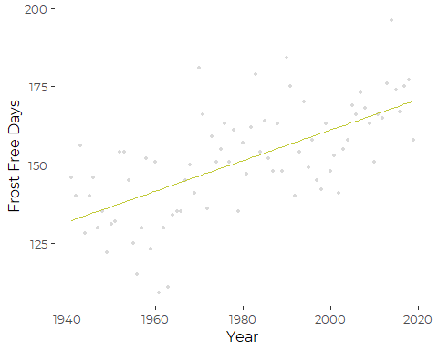
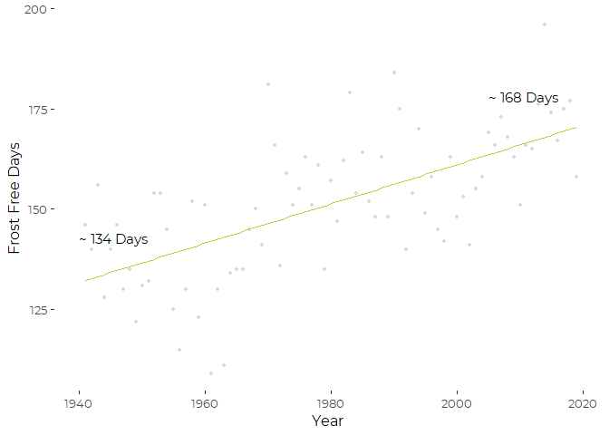
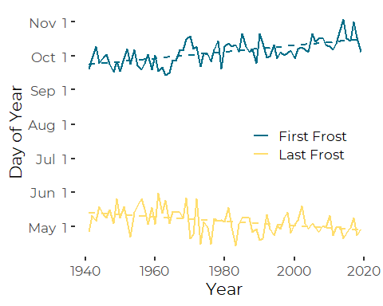

Graphics for Length of Growing Season
================
Curtis C. Bohlen, Casco Bay Estuary Partnership.
11/16/2021

-   [Load Libraries](#load-libraries)
-   [Read Data](#read-data)
-   [Find First and Last Frost Dates](#find-first-and-last-frost-dates)
-   [Frost Free Days](#frost-free-days)
    -   [Evaluating Net Changes](#evaluating-net-changes)
-   [First and Last Frost Dates](#first-and-last-frost-dates)


# Load Libraries

``` r
library(tidyverse)
#> Warning: package 'tidyverse' was built under R version 4.0.5
#> -- Attaching packages --------------------------------------- tidyverse 1.3.1 --
#> v ggplot2 3.3.5     v purrr   0.3.4
#> v tibble  3.1.6     v dplyr   1.0.7
#> v tidyr   1.1.4     v stringr 1.4.0
#> v readr   2.1.0     v forcats 0.5.1
#> Warning: package 'ggplot2' was built under R version 4.0.5
#> Warning: package 'tidyr' was built under R version 4.0.5
#> Warning: package 'dplyr' was built under R version 4.0.5
#> Warning: package 'forcats' was built under R version 4.0.5
#> -- Conflicts ------------------------------------------ tidyverse_conflicts() --
#> x dplyr::filter() masks stats::filter()
#> x dplyr::lag()    masks stats::lag()
library(readr)

library(CBEPgraphics)
load_cbep_fonts()
theme_set(theme_cbep())
```

# Read Data

The frost-free period needs to be derived directly from the daily
temperature data. Note that temperature in the source data is in tenths
of a degree C.

``` r
sibfldnm <- 'Data'
parent <- dirname(getwd())
sibling <- paste(parent,sibfldnm, sep = '/')
fn <- 'longdailydata.csv'

dir.create(file.path(getwd(), 'figures'), showWarnings = FALSE)
```

``` r
longdailydata <- read_csv(file.path(sibling,fn)) %>%
  select(-station) %>%
  filter(datatype %in% c('TMAX', 'TMIN')) %>%
  mutate(doy = as.numeric(format(date, format = '%j'))) %>%
  mutate(month = as.numeric(format(date, format = '%m'))) %>%
  mutate(year = as.numeric(format(date, format = '%Y'))) %>%
  mutate(cyear = year - 1980)
#> Rows: 370361 Columns: 5
#> -- Column specification --------------------------------------------------------
#> Delimiter: ","
#> chr  (3): datatype, attributes, station
#> dbl  (1): value
#> dttm (1): date
#> 
#> i Use `spec()` to retrieve the full column specification for this data.
#> i Specify the column types or set `show_col_types = FALSE` to quiet this message.
```

# Find First and Last Frost Dates

The following strategy was suggested by a Stack Overflow answer here:  
<https://stackoverflow.com/questions/41328946/find-last-values-by-condition>

In brief, we filter a dataframe down to data that meets our criteria –
here, days with temperatures below freezing – and then group\_by() to
isolate data from each year, and finally slice() to pick the first or
last item in the list. Be aware that this strategy depends on the data
being in chronological order.

``` r
cutoffinF <- 32
cutoffinC <- (cutoffinF - 32) * 5/9

firstfrosts <- longdailydata %>%
  pivot_wider(names_from = datatype, values_from = value) %>%
  filter(year > 1940) %>%               # 1940 is an incomplete year in the daily data
  mutate(TMIN = TMIN/10) %>%            # raw data is in tenths of degree C
  filter(TMIN <= cutoffinC) %>%         # Only days below freezing
  filter(month >= 7) %>%                # only the last half of the year
  group_by(year) %>%
  slice(1)  %>%                         # Choose the first record
  select(date, year, doy)

lastfrosts <- longdailydata %>%
  pivot_wider(names_from = datatype, values_from = value) %>%
  filter(year > 1940) %>%                 # 1940 is an incomplete year in the daily data
  mutate(TMIN = TMIN/10) %>%            # raw data is in tenths of degree C
  filter(TMIN <= cutoffinC) %>%          # Only days below freezing
  filter(month < 7) %>%                   # only the first half of the year
  group_by(year) %>%
  slice(n())  %>%                       # Choose the last record
  select(date, year, doy)

frosts <- inner_join(firstfrosts,lastfrosts, by = "year", 
                     suffix = c('.first', '.last')) %>%
  mutate(frostfree = doy.first - doy.last - 1) # calculate frost-free period

rm(firstfrosts,lastfrosts)
```

# Frost Free Days

Note that as all we fit were simple linear models, we can create
graphics using geom\_smooth() with method =‘lm’. We really only need the
model to extract net change data from model predictions.

``` r
plt <- ggplot(frosts, aes(year, frostfree)) + 
  geom_point(color = 'gray85', size = 1) +
  geom_smooth(method = 'lm', se = FALSE, lty=1, lwd = 0.5, color = cbep_colors()[4]) +
  ylab('Frost Free Days') +
  xlab('Year') +
  theme_cbep(base_size = 12)
  
plt
#> `geom_smooth()` using formula 'y ~ x'
```



``` r
ggsave('figures/frostfree.pdf', device=cairo_pdf, width = 5, height = 45)
#> `geom_smooth()` using formula 'y ~ x'
```

## Evaluating Net Changes

``` r
the.lm <- lm(frostfree~year, frosts)
nd <- tibble(year = c(1945, 2015))
(p <- round(predict(the.lm, newdata = nd), 0))
#>   1   2 
#> 134 168
```

| Metric            | Value     |
|-------------------|-----------|
| Typical, 1940s:   | 134       |
| Typical, 2010s:   | `p[2]`    |
| Net Change:       | 34        |
| Change Per Decade | 4.8571429 |

``` r
labs = tibble(x = c(1940, 2005),
              y = c(143,178),
              txt = c(paste('~', p[1], 'Days'),
                      paste('~', p[2], 'Days')))

plt + geom_text(aes(x = x, y = y, label = txt), data = labs, hjust = 0)
#> `geom_smooth()` using formula 'y ~ x'
```



``` r
ggsave('figures/FrostFree.pdf', width = 7, height = 5, device = cairo_pdf)
#> `geom_smooth()` using formula 'y ~ x'
```

# First and Last Frost Dates

``` r
tmp <- frosts %>%
  select(-doy.first, -doy.last, -frostfree) %>%
  gather(key = 'indicator', value = 'date', -year) %>%
  mutate(month = format(date, format = '%m')) %>%
  mutate(day = format(date, format = '%d' )) %>%
  mutate(day = ifelse(day == '29' & month == '02', '28', day)) %>%   # Check for unlikely event of leap day
  mutate(compdate = as.Date(paste(month,day,'2019', sep = '/'), format = '%m/%d/%Y'))
```

``` r
plt <- ggplot(tmp, aes(year, compdate, color=indicator)) + geom_line(lwd = 1) +
  geom_smooth(method = 'lm', se = FALSE, lty = 2) +
  scale_color_manual(values = cbep_colors(), name = '', labels = c('First Frost', 'Last Frost')) +
  xlab('Year') +
  ylab('Day of Year') +
  theme_cbep()

plt +
  scale_y_date(date_breaks = '1 month', date_labels = '%b %e') +
  theme(legend.position = c(0.75,0.5))
#> `geom_smooth()` using formula 'y ~ x'
```


