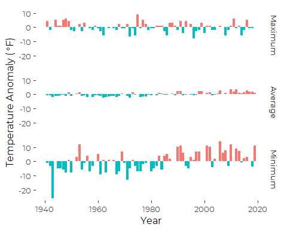
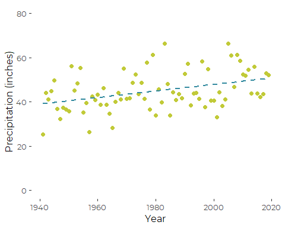

Graphics for Portland Jetport Historical Weather
================
Curtis C. Bohlen, Casco Bay Estuary Partnership.
11/15/2021

-   [Install Libraries](#install-libraries)
-   [Read Data](#read-data)
-   [Annual Minimum, Maximum and Average
    Temperature](#annual-minimum-maximum-and-average-temperature)
    -   [Use `lm()` to calculate slopes](#use-lm-to-calculate-slopes)
-   [Temperature Anomaly Figures](#temperature-anomaly-figures)
    -   [Create Lines to plot](#create-lines-to-plot)
-   [Precipitation Totals](#precipitation-totals)
    -   [Read Data and Transform to English
        Units.](#read-data-and-transform-to-english-units)


# Install Libraries

``` r
library(tidyverse)
#> Warning: package 'tidyverse' was built under R version 4.0.5
#> -- Attaching packages --------------------------------------- tidyverse 1.3.1 --
#> v ggplot2 3.3.5     v purrr   0.3.4
#> v tibble  3.1.6     v dplyr   1.0.7
#> v tidyr   1.1.4     v stringr 1.4.0
#> v readr   2.1.0     v forcats 0.5.1
#> Warning: package 'ggplot2' was built under R version 4.0.5
#> Warning: package 'tidyr' was built under R version 4.0.5
#> Warning: package 'dplyr' was built under R version 4.0.5
#> Warning: package 'forcats' was built under R version 4.0.5
#> -- Conflicts ------------------------------------------ tidyverse_conflicts() --
#> x dplyr::filter() masks stats::filter()
#> x dplyr::lag()    masks stats::lag()
library(readr)

library(CBEPgraphics)
load_cbep_fonts()
theme_set(theme_cbep())
```

# Read Data

``` r
sibfldnm <- 'Data'
parent <- dirname(getwd())
sibling <- paste(parent,sibfldnm, sep = '/')
fn <- 'longannualdata.csv'

dir.create(file.path(getwd(), 'figures'), showWarnings = FALSE)
```

``` r
longannualdata <- read_csv(paste(sibling,fn, sep = '/')) %>%
  select(-station) %>%
  mutate(year = as.numeric(format(date, format='%Y'))) %>%
  mutate(cyear = year-1980)
#> Rows: 2981 Columns: 5
#> -- Column specification --------------------------------------------------------
#> Delimiter: ","
#> chr  (3): datatype, attributes, station
#> dbl  (1): value
#> dttm (1): date
#> 
#> i Use `spec()` to retrieve the full column specification for this data.
#> i Specify the column types or set `show_col_types = FALSE` to quiet this message.
```

# Annual Minimum, Maximum and Average Temperature

Codes for Key Temperature records in the downloaded annual data are:
TAVG – Annual Average Temperature (unweighted; effectively average of
monthly averages, of daily maxes and mins. Note that this means this is
not independent of the other two metrics.)  
EMXT – Extreme Maximum Annual Temperature  
EMNT – Extreme Minimum Temperature

``` r
tdata <- longannualdata %>%
  filter(datatype %in% c('TAVG', 'EMXT', 'EMNT')) %>%
  mutate(value = value*(9/5)+32) %>%
  mutate(datatype = factor(datatype, levels = c('EMXT', 'TAVG', 'EMNT' )))
```

``` r
plt <- ggplot(tdata, aes(year, value, color=datatype)) + 
  geom_point(color = 'gray85', size = 1) +
  xlab('Year') +
  ylab (expression('Temperature ('*~degree*F*')')) +
  theme_cbep(base_size = 12)
```

## Use `lm()` to calculate slopes

We need the linear models to develop the annotations, but since we are
using linear models here, we can use `geom_smooth()`. We can suppress
plotting a regression line by assigning `linetype`.

``` r
tdataF <- longannualdata %>%
  filter(datatype %in% c('TAVG', 'EMXT', 'EMNT')) %>%
  mutate(value = value*(9/5)+32) %>%
  mutate(datatype = factor(datatype, levels = c('EMXT', 'TAVG', 'EMNT' ))) %>%
  pivot_wider(names_from = datatype, values_from = value)
mean.lm <- lm(TAVG~ cyear, data = tdataF)
min.lm <- lm(EMNT~ cyear, data = tdataF)

labs <-  tibble(datatype = c("EMXT", "TAVG", "EMNT"),
              ypos1 = c(85, 55, 5),
              xpos = c(1950, 2000, 2000),
              txt = c("No~trend",
                       paste(round(mean.lm$coef[2]*10,2), '~degree*F', "~per~decade"),
                       paste(round(min.lm$coef[2]*10,2), '~degree*F', "~per~decade")) ) %>%
  mutate(datatype = factor(datatype, levels = c('EMXT', 'TAVG', 'EMNT' ))) 
```

``` r
plt + 
geom_smooth(aes(color=datatype, lty = datatype), method = 'lm', 
              formula = y~x, se = FALSE, lwd = 0.5 ) +
  geom_text(aes(x=xpos, y=ypos1, label= txt), 
            data = labs, 
            parse=TRUE, 
            show.legend = FALSE, 
            size = 3,
            color = 'grey15') +
  scale_color_manual(values =cbep_colors2(), name = 'Annual Values',
                     labels = c('Maximum', 'Average', 'Minimum')) +
  scale_linetype_manual(values = c(0,1,1), name = 'Annual Values',
                        labels = c('Maximum', 'Average', 'Minimum')) +
  theme_cbep(base_size = 10) +
  theme(legend.title = element_text(size = 9),
        legend.text = element_text(size = 8),
        legend.key.height = unit(.4, 'cm')) 
```


``` r
ggsave('figures/maxavgmin.pdf', device = cairo_pdf, width = 5,height = 4)
```

# Temperature Anomaly Figures

That graphic is not very satisfying, as the slopes are difficult to
perceive. It might be better to present these as temperature anomalies.

``` r
tdata.centered <- longannualdata %>%
  filter(datatype %in% c('TAVG', 'EMXT', 'EMNT')) %>%
  mutate(value = value*(9/5)+32) %>%
  select(-attributes) %>%
  spread(key = datatype, value = value) %>%
  mutate_at(c('TAVG', 'EMXT', 'EMNT'), ~ scale(., scale = FALSE)) %>%
  gather(key = 'datatype', value = 'value', -date, -year, -cyear) %>%
  mutate(datatype = factor(datatype, levels = c('EMXT', 'TAVG', 'EMNT' ))) 
#> Warning: attributes are not identical across measure variables;
#> they will be dropped

tdata.centered.wide <- tdata.centered %>%
  pivot_wider(names_from = datatype, values_from = value)

mean.lm.2 <- lm(TAVG~ cyear, data = tdata.centered.wide)
min.lm.2 <- lm(EMNT~ cyear, data = tdata.centered.wide)
max.lm.2 <- lm(EMXT~ cyear, data = tdata.centered.wide)
```

We can fill in anomalies with different colors, as follows. This uses
`geom_bar()`.

``` r
type.labs <- c('Maximum', 'Average', 'Minimum')
names(type.labs) <- c("EMXT", "TAVG", "EMNT")

plt1 <- ggplot(tdata.centered, aes(year, value)) + 
  geom_bar(aes(fill = ifelse(value <0, "red4", "blue")),
           stat = "identity", position = "identity") +
  scale_fill_discrete(name = '', labels = c('Above Average', 'Below Average')) +
  xlab('Year') +
  ylab (expression('Temperature Anomaly ('*~degree*F*')')) +
  facet_wrap('datatype', nrow=3, scales = 'fixed', # alternative is "free_y"
             labeller = labeller(datatype = type.labs),
             strip.position = 'right') +
  theme_cbep(base_size = 12) +
  theme(legend.position = "none")
plt1
```



## Create Lines to plot

Note the way I assemble a mathematical expression to be interpreted by
“plotmath” for the annotations. The key idea is that you need to link
each symbol or word either with “\~” if you want a space, or "\*" if you
don’t.

``` r
labs <-  tibble(datatype = c("EMXT", "TAVG", "EMNT"),
              ypos1 = c(-8, -8, -8),
              ypos2 = c(-2, -1.5, -5),
              xpos = c(1950, 2000, 2000),
              txt = c("No~trend",
                       paste(round(mean.lm.2$coef[2]*10,2), '~degree*F', "~per~decade"),
                       paste(round(min.lm.2$coef[2]*10,2), '~degree*F', "~per~decade")) ) %>%
  mutate(datatype = factor(datatype, levels = c('EMXT', 'TAVG', 'EMNT' ))) 
```

``` r
plt1 +
  geom_smooth(method = 'lm', se = FALSE, 
              color = 'gray15', size = 0.5, lty = 2) +
  
  geom_text(aes(x=xpos, y=ypos1, label= txt), data = labs, parse=TRUE, size = 3)
#> `geom_smooth()` using formula 'y ~ x'
```


``` r
ggsave('figures/tempanomolies1.pdf',
       device=cairo_pdf, width = 5, height = 4)
#> `geom_smooth()` using formula 'y ~ x'
```

# Precipitation Totals

Codes for key annual PRECIPITATION records in the downloaded data are:

PRCP: Total Monthly (Annual) precipitation. Precipitation totals are
based on daily or multi-day (if daily is missing) precipitation report,
in millimeters to tenths.  
SNOW: Total Monthly (Annual) Snowfall in millimeters.

## Read Data and Transform to English Units.

``` r
pdatalong <- longannualdata %>%
  filter(datatype %in% c('PRCP', 'SNOW')) %>%
  mutate(datatype = factor(datatype)) %>%
  mutate(value = value*0.0394)           # Convert to inches from tenths of mm

pdata <- longannualdata %>%
  filter(datatype %in% c('PRCP', 'SNOW')) %>%
  mutate(datatype = factor(datatype)) %>%
  mutate(value = value*0.0394) %>%
  pivot_wider(names_from=datatype, values_from=value)
```

``` r
precip.lm <- lm(PRCP~year, data = pdata)
```

``` r
plt <- ggplot(pdata, aes(year, PRCP)) + 
  geom_point(size=2, color = cbep_colors()[4]) +
  geom_smooth(method='lm', se=FALSE, lty=2, color = cbep_colors()[5]) +
  xlab('Year') +
  ylab('Precipitation (inches)') +
  ylim(c(0,80))  +
  theme_cbep(base_size = 12)
plt
#> `geom_smooth()` using formula 'y ~ x'
#> Warning: Removed 1 rows containing non-finite values (stat_smooth).
#> Warning: Removed 1 rows containing missing values (geom_point).
```



``` r
txt <- paste('+~', round(precip.lm$coef[2]*10,2), '~inches', "~per~decade")
plt + 
  geom_text(aes(x=1995, y=25, label= txt), parse=TRUE, hjust=0, size = 3)
#> `geom_smooth()` using formula 'y ~ x'
#> Warning: Removed 1 rows containing non-finite values (stat_smooth).
#> Warning: Removed 1 rows containing missing values (geom_point).
```


``` r
ggsave('figures/precip.pdf', device=cairo_pdf, width = 5, height = 4)
#> `geom_smooth()` using formula 'y ~ x'
#> Warning: Removed 1 rows containing non-finite values (stat_smooth).

#> Warning: Removed 1 rows containing missing values (geom_point).
```
